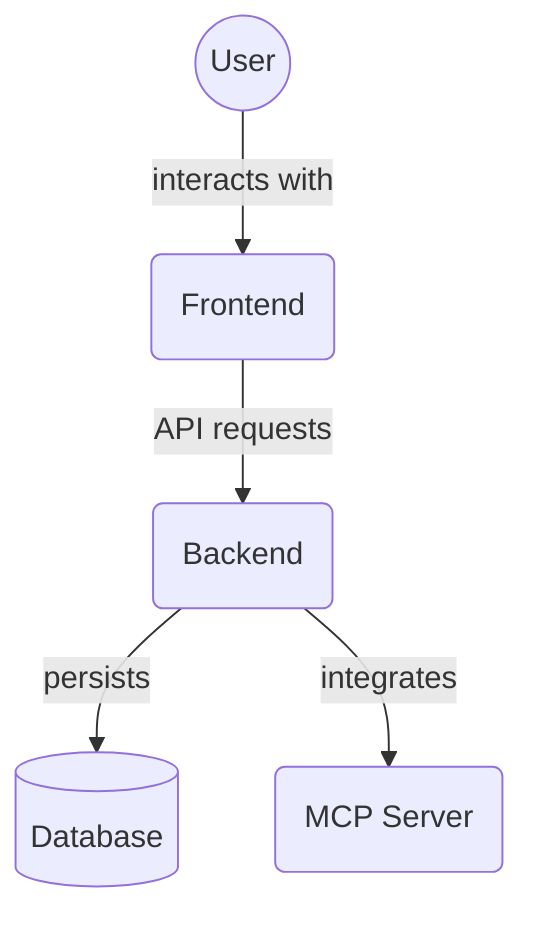

# GitHub Configuration (`.github/`)

This directory stores configurations and templates specific to the project's GitHub repository. These files help manage workflows, standardize issue reporting, and guide contributions.

## Contents

-   **`ISSUE_TEMPLATE/`**:
    -   Contains templates for creating new GitHub issues (e.g., bug reports, feature requests). When a user opens a new issue, they can choose from these templates to provide structured information.

-   **`PULL_REQUEST_TEMPLATE.md`**:
    -   This Markdown file provides a template for pull requests. When a contributor creates a pull request, the content of this file is pre-populated into the PR description, prompting them to include relevant details about their changes.

-   **`workflows/`**:
    -   This subdirectory holds GitHub Actions workflow definition files (YAML format).
    -   **`ci.yml`**: Defines the Continuous Integration (CI) workflow. This workflow likely runs automatically on events like pushes or pull requests to branches like `main` or `develop`. It typically includes steps to:
        -   Set up the environment (e.g., specific Node.js and Python versions).
        -   Install dependencies for frontend and backend.
        -   Run linters to check code style.
        -   Execute automated tests for both frontend and backend.
        -   Potentially build the applications.
        -   The badge at the top of the main `README.md` (  ) usually reflects the status of this CI workflow.

These configurations are standard for GitHub-hosted projects and aim to improve collaboration, code quality, and automation.

## Architecture Diagram

<!-- File List Start -->
## File List

- `PULL_REQUEST_TEMPLATE.md`

<!-- File List End -->

