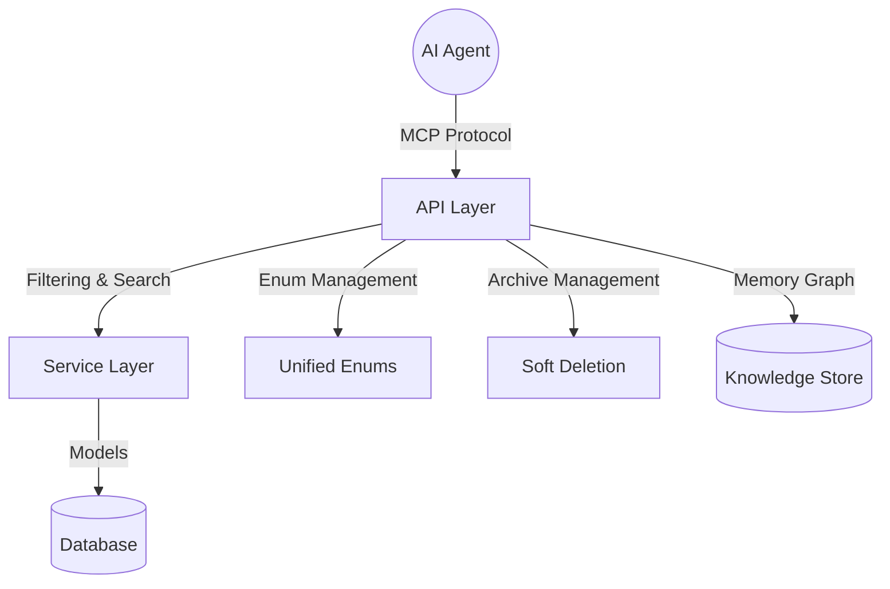

# AGENTS.md for MCP Project Manager

This repository is a **Task Manager** built with **FastAPI** (backend) and **Next.js** (frontend), designed for human-agent collaboration via the **Model Context Protocol (MCP)**. The backend provides **46 REST API routes** for projects, tasks, users, agents, and memory services with filtering, enum management, and standardized response models.

## 🚀 Quick Start

```bash
# One-command setup and launch
python start_system.py

# Or use the development launchers
node scripts/dev/dev_launcher.js          # Cross-platform Node.js
.\scripts\dev\dev_launcher.ps1            # Windows PowerShell  
.\scripts\dev\dev_launcher.bat            # Windows Batch

# Or traditional approach
npm run dev     # runs scripts/dev/dev_launcher.bat (on Windows) or you can run `node scripts/dev/dev_launcher.js` cross-platform
```

## 🏗️ Tech Stack & Architecture

### **Backend (API/MCP Server)**
FastAPI (Python 3.8+) with **46 API routes** featuring:
- **Filtering**: Projects by status/priority/visibility, Tasks by agent/status, Users by role/active status
- **Unified Enum System**: Centralized in `backend/enums.py` with `/api/v1/enums/` endpoints
- **Response Models**: `DataResponse[T]` and `ListResponse[T]` with pagination
- **Archive Management**: Soft deletion with restore across Projects, Tasks, Agents
- **Search**: Full-text search across names, descriptions, and relevant fields

**Core Components:**
- `main.py`: FastAPI app with 46 routes
- `models/`: Database models with enum integration
- `schemas/`: Pydantic models with validation
- `services/`: Business logic with filtering and pagination
- `routers/`: API endpoints organized by domain
- `enums.py`: **Unified enum definitions**
- Memory Service: Knowledge graph with relationship mapping

### **Frontend (Web GUI)**
Next.js (React + TypeScript) with Chakra UI, featuring:
- **Dynamic Filtering**: Dropdown population from enum endpoints
- **Search**: Real-time filtering across all entity types
- **Status Management**: Visual status indicators and workflow transitions
- **Responsive Design**: Optimized for both desktop and mobile

### **API Categories (46 Routes)**

#### **Projects** (`/api/v1/projects/`) - 8 Routes
- `GET /` - filtering (status, priority, visibility, search, archived, owner)
- `POST /` - Create with enum validation
- `GET /{id}` - Details with relationships
- `PUT /{id}` - Update with status workflow
- `POST /{id}/archive` - Archive with audit logging
- `POST /{id}/unarchive` - Restore functionality
- `DELETE /{id}` - Admin-only deletion
- **Project Status**: `active`, `completed`, `paused`, `archived`, `cancelled`
- **Priority Levels**: `low`, `medium`, `high`, `critical`
- **Visibility**: `private`, `team`, `public`

#### **Tasks** (`/api/v1/projects/{project_id}/tasks/`) - 12 Routes
- `GET /` - filtering (agent, status, search, archived, sorting)
- `POST /` - Create with project association
- `GET /{task_number}` - Project-scoped task details
- `PUT /{task_number}` - Update with status validation
- `POST /{task_number}/archive` - Archive with workflow preservation
- `POST /{task_number}/unarchive` - Restore with history
- **Task Status**: 18 workflow states including context acquisition, planning, execution, verification
- **Dependencies**: Predecessor/successor relationships with types

#### **Users** (`/api/v1/users/`) - 6 Routes
- `GET /` - Role-based filtering (role, active status, search across username/email/full_name)
- `POST /` - Create user (admin only)
- `GET /{id}` - User details with roles
- `PUT /{id}` - Update (self or admin)
- `DELETE /{id}` - Archive user (admin only)
- **Multi-role Support**: Users can have multiple roles with permissions

#### **Agents** (`/api/v1/agents/`) - 8 Routes
- `GET /` - Status filtering (status, search, archived, capabilities)
- `POST /` - Register with capability validation
- `GET /{id}` - Agent details with status
- `PUT /{id}` - Update capabilities and status
- `POST /{id}/archive` - Archive with task reassignment
- `POST /{id}/unarchive` - Restore with capability validation
- **Agent Management**: Status tracking, capability assignment, task integration

#### **Enums** (`/api/v1/enums/`) - 5 Routes
- `GET /project-status` - Available project statuses for dropdowns
- `GET /project-priority` - Available priority levels
- `GET /project-visibility` - Available visibility options
- `GET /project-member-role` - Available member roles
- `GET /task-status` - Available task statuses for workflow UI

#### **Memory & Knowledge Graph** (`/api/v1/memory/`) - 4+ Routes
- `POST /ingest/upload` - File upload to knowledge graph
- `POST /ingest-url` - URL content ingestion
- `POST /ingest-text` - Text processing and storage
- `GET /entities/graph` - Retrieve knowledge graph with pagination

#### **MCP Tools** (`/mcp-tools/`) - 3+ Routes
- Agent automation and management endpoints
- Metrics with usage tracking
- Stream event subscription for real-time updates

## 🎯 Agent Capabilities

### **Filtering & Search**
Agents can utilize filtering across all entities:

```python
# Project filtering example
GET /api/v1/projects/?status=active&priority=high&search=urgent&is_archived=false&sort_by=created_at&sort_direction=desc

# Task filtering with agent assignment
GET /api/v1/projects/{project_id}/tasks/?agent_id=agent123&status=IN_PROGRESS&search=debug&is_archived=false

# User management with role filtering
GET /api/v1/users/?role_filter=ENGINEER&is_active=true&search=john&sort_by=created_at
```

### **Enum-Driven Development**
Agents should utilize enum endpoints for status management:

```python
# Get available statuses for UI dropdowns
GET /api/v1/enums/project-status  # Returns: ['active', 'completed', 'paused', 'archived', 'cancelled']
GET /api/v1/enums/task-status     # Returns: 18 workflow statuses
```

### **Archive Management Pattern**
Soft deletion with restore capabilities:

```python
# Archive entities (preserves data and relationships)
POST /api/v1/projects/{id}/archive
POST /api/v1/projects/{project_id}/tasks/{task_number}/archive
POST /api/v1/agents/{id}/archive

# Restore archived entities
POST /api/v1/projects/{id}/unarchive
POST /api/v1/projects/{project_id}/tasks/{task_number}/unarchive
POST /api/v1/agents/{id}/unarchive
```

### **Response Models**
All endpoints use standardized response patterns:

```typescript
// Single item responses
interface DataResponse<T> {
  data: T;
  message: string;
  timestamp: string;
}

// List responses with pagination
interface ListResponse<T> {
  data: T[];
  total: number;
  page: number;
  page_size: number;
  has_more: boolean;
  message: string;
}
```

## 🛠️ Setup & Bootstrapping

### **Backend Environment**
```bash
cd backend
python3 -m venv .venv
source .venv/bin/activate       # Windows: .venv\Scripts\activate
pip install -r requirements.txt
```

### **Database Setup with Models**
```bash
cd backend
python -m alembic upgrade head  # Creates tables with schema
python init_db.py              # Seeds with example data including enums
```

### **Verify API**
```bash
# Start backend (46 routes should load)
uvicorn backend.main:app --reload --host 0.0.0.0 --port 8000

# Verify structure
curl http://localhost:8000/docs  # Should show 46 organized endpoints
curl http://localhost:8000/api/v1/enums/project-status  # Test new enum endpoints
```

## 🧪 Testing & Validation

### **API Testing with Features**
```bash
# Backend tests with coverage
cd backend
pytest tests/ -v --cov=backend --cov-report=html

# Test filtering
pytest tests/test_projects_crud.py::test_project_filtering -v
pytest tests/test_tasks_crud.py::test_task_filtering -v
```

### **Frontend Tests with Enum Integration**
```bash
cd frontend
npm run test:unit      # Test enum dropdown components
npm run test:e2e       # Test filtering workflows
npm run test:coverage  # Ensure enum integration covered
```

## 🎯 Agent Development Guidelines

### **Status Management Best Practices**
1. **Always use enum endpoints** for status validation
2. **Check available statuses** before transitions
3. **Use archive/unarchive** instead of hard deletion
4. **Validate enum values** in business logic

### **Filtering Implementation**
1. **Implement pagination** for all list endpoints
2. **Support multiple filter combinations** 
3. **Provide search across relevant fields**
4. **Include total counts** for UI pagination

### **Response Model Consistency**
1. **Use DataResponse[T]** for single items
2. **Use ListResponse[T]** for collections
3. **Include meaningful messages** in responses
4. **Handle errors with consistent format**

### **Archive Management**
1. **Implement soft deletion** with archive flags
2. **Preserve relationships** during archival
3. **Provide restore functionality**
4. **Log archive/restore operations**

## 🔧 Development Workflow

### **Model Updates**
When updating models, ensure enum consistency:
```bash
# Generate migration after model changes
cd backend
alembic revision --autogenerate -m "Model with new enums"
alembic upgrade head
```

### **Endpoint Development**
Follow the patterns:
1. **Add filtering parameters** to GET endpoints
2. **Use enum validation** in request schemas
3. **Implement archive/unarchive** for entities
4. **Add enum endpoints** for new entity types

### **Testing New Features**
1. **Test filtering combinations** thoroughly
2. **Verify enum endpoint responses**
3. **Test archive/restore workflows**
4. **Validate response model consistency**

## 🧠 Architecture Understanding

The architecture provides:



### **Key Architectural Principles**
1. **Single Source of Truth**: Enums centralized in `backend/enums.py`
2. **Patterns**: All endpoints follow same structure
3. **Filtering**: Search and filter capabilities
4. **Soft Deletion**: Archive/restore instead of hard deletes
5. **Validation**: Enum-based validation throughout

## 🎯 Agent Task Examples

### **Project Management Task**
```python
# 1. Get available project statuses
statuses = GET /api/v1/enums/project-status

# 2. Filter active high-priority projects
projects = GET /api/v1/projects/?status=active&priority=high&is_archived=false

# 3. Update project with status transition
PUT /api/v1/projects/{id} {"status": "completed"}

# 4. Archive completed project
POST /api/v1/projects/{id}/archive
```

### **Task Workflow Management**
```python
# 1. Get available task statuses for workflow
task_statuses = GET /api/v1/enums/task-status

# 2. Filter tasks by agent and status
tasks = GET /api/v1/projects/{id}/tasks/?agent_id=agent123&status=IN_PROGRESS

# 3. Transition task status
PUT /api/v1/projects/{id}/tasks/{task_number} {"status": "COMPLETED"}

# 4. Archive completed task
POST /api/v1/projects/{id}/tasks/{task_number}/archive
```

This architecture provides agents with APIs for project and task management with filtering, status management, and data integrity features.
