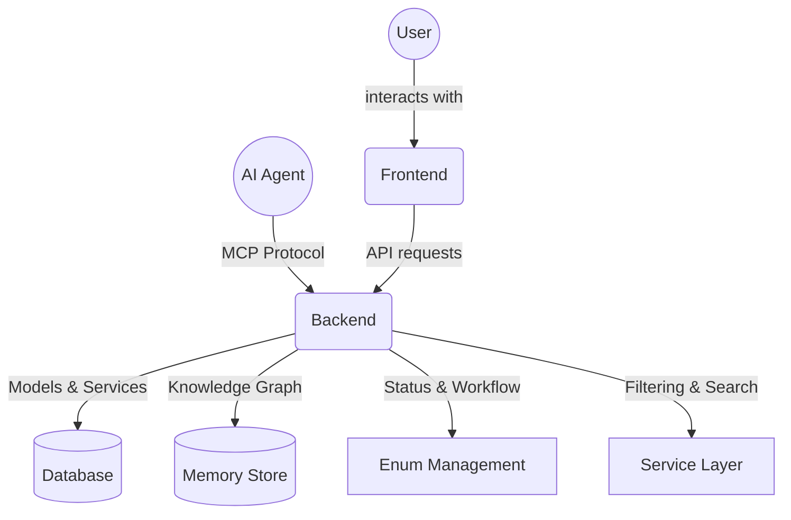

Here is the **full, resolved `README.md`** file with all sections and previously conflicting parts properly merged:

```markdown
[](https://github.com/m0st4f4-hub/MCP-ProjectManager/actions/workflows/ci.yml)
[](https://badge.fury.io/js/mcp-project-manager-cli)
[](https://opensource.org/licenses/ISC)

# MCP Project Manager Suite

An open-source, full-stack suite for collaborative project management, empowering human users and AI agents to manage, automate, and execute complex projects—end-to-end. Built with a FastAPI backend, a Next.js/Chakra UI frontend, and integrated with the Model Context Protocol (MCP) for agentic capabilities.

---

## 🚀 Quick Start

### One-Command Development Setup

```bash
python launcher.py
```

This will automatically:

* ✅ Launch the FastAPI backend and Next.js frontend together
* ✅ Clear ports 8000 and 3000
* ✅ Open API docs at [http://localhost:8000/docs](http://localhost:8000/docs)
* 📄 API schema snapshot: `backend/openapi.json`

### Alternative Launch Methods

```bash
# Quick start options:
python launcher.py                        # Cross-platform Python script
node scripts/dev/dev_launcher.js          # Cross-platform Node.js
# OR
powershell scripts/dev/dev_launcher.ps1   # PowerShell (Windows)
```

### Database Migrations

Apply pending migrations using the CLI:

```bash
node scripts/utils/cli.js migrate
```

See [`docs/02-setup/README.md`](./docs/02-setup/README.md) for complete setup instructions.
For an overview of all dev scripts, see [`scripts/README.md`](./scripts/README.md).
For required environment variables and defaults, check [`docs/02-setup/README.md#environment-variables`](./docs/02-setup/README.md#environment-variables).
If you're contributing, read the [`docs/03-development/README.md`](./docs/03-development/README.md) guide.

---

## 🧱 Tech Stack

* **Backend:** FastAPI, SQLAlchemy, Pydantic, Alembic, SQLite/PostgreSQL
* **Frontend:** Next.js, Chakra UI, TypeScript, Zustand
* **Orchestration & Agents:** MCP Server, `.cursor` rules, fastapi-mcp
* **Dev & CLI:** Node.js, Python, Commander.js

---

## 📁 Project Structure

```text
project-manager/
├── backend/                # FastAPI service (46 routes)
│   ├── models/             # Database models
│   ├── schemas/            # Pydantic schemas with validation
│   ├── services/           # Business logic services
│   ├── routers/            # API endpoints organized by domain
│   │   ├── projects/       # Project management (core, files, members, planning)
│   │   ├── tasks/          # Task management (core, dependencies)
│   │   ├── users/          # User management with role filtering
│   │   ├── agents/         # AI agent management
│   │   ├── enums/          # Enum value endpoints
│   │   └── mcp/            # MCP tool integration
│   ├── enums.py            # Enum definitions
│   └── database.py         # Database configuration
├── frontend/               # Next.js + Chakra UI app
├── docs/                   # Comprehensive documentation
│   ├── 01-overview/        # Project overview and introduction
│   ├── 02-setup/           # Setup and installation guide
│   ├── 03-development/     # Development guide and standards
│   ├── 04-api/             # Complete API documentation
│   ├── 06-agents/          # Agent development guide
│   └── 08-operations/      # Operations and troubleshooting
├── scripts/                # Development and utility scripts
│   ├── dev/                # Development launchers
│   ├── utils/              # Utility scripts and CLI
│   └── README.md           # Scripts documentation
├── .cursor/                # MCP rules
├── start_system.py         # One-command setup
├── sql_app.db              # SQLite DB (default)
├── .github/                # CI/CD workflows
```

---

## ✅ Features

### 🎯 Core Functionality
* **Human-agent task collaboration** with workflow management
* **Project lifecycle management** with status tracking
* **Filtering & search** across projects, tasks, users, and agents
* **Task dependencies, archiving, and status transitions**
* **Role-based access control** with permissions
* **Memory service integration** with knowledge graph storage

### 🔧 API Features
* **Filtering** by status, priority, visibility, and custom fields
* **Pagination with total counts** for data loading
* **Archive/unarchive endpoints** for soft deletion
* **Enum value endpoints** for frontend dropdown population
* **Standardized response models** with error handling

### 🏗️ Project Management
* **Project Status Management**: `active`, `completed`, `paused`, `archived`, `cancelled`
* **Priority Levels**: `low`, `medium`, `high`, `critical`
* **Visibility Controls**: `private`, `team`, `public`
* **Search**: Filter by name, description, owner, and metadata
* **Member Management**: Role-based project access with CRUD operations

### 📋 Task Management
* **Status Tracking**: 18 distinct task statuses including workflow states
* **Task Dependencies**: Predecessor/successor relationships with dependency types
* **Task Assignment**: Agent-based task allocation with status transitions
* **Archive Management**: Soft deletion with restore capabilities

### 👥 User & Agent Management
* **User Filtering**: Search by username, email, full name
* **Role-based Filtering**: Filter users by assigned roles
* **Agent Status Management**: Track agent availability and capabilities
* **Consistent Response Models**: Standardized API responses across all endpoints

### 🔄 Memory & Knowledge Graph
* **File Upload Integration**: `/api/memory/ingest/upload`
* **URL Ingestion**: `/api/memory/ingest-url`
* **Text Processing**: `/api/memory/ingest-text`
* **Graph Visualization**: Knowledge relationship mapping

### 📊 API Endpoints Overview

#### Projects (`/api/v1/projects/`)
- `GET /` - List projects with filtering (status, priority, visibility, search, archived)
- `POST /` - Create new project
- `GET /{id}` - Get project details
- `PUT /{id}` - Update project
- `POST /{id}/archive` - Archive project
- `POST /{id}/unarchive` - Unarchive project
- `DELETE /{id}` - Delete project

#### Tasks (`/api/v1/projects/{project_id}/tasks/`)
- `GET /` - List tasks with filtering (agent, status, search, archived, sorting)
- `POST /` - Create task
- `GET /{task_number}` - Get task details
- `PUT /{task_number}` - Update task
- `POST /{task_number}/archive` - Archive task
- `POST /{task_number}/unarchive` - Unarchive task

#### Users (`/api/v1/users/`)
- `GET /` - List users with filtering (role, active status, search)
- `POST /` - Create user (admin only)
- `GET /{id}` - Get user details
- `PUT /{id}` - Update user
- `DELETE /{id}` - Delete user

#### Agents (`/api/v1/agents/`)
- `GET /` - List agents with filtering (status, search, archived)
- `POST /` - Register agent
- `GET /{id}` - Get agent details
- `PUT /{id}` - Update agent
- `POST /{id}/archive` - Archive agent

#### Enums (`/api/v1/enums/`)
- `GET /project-status` - Available project statuses
- `GET /project-priority` - Available project priorities
- `GET /project-visibility` - Available visibility levels
- `GET /task-status` - Available task statuses

### Uploading Files to Memory

```bash
curl -X POST -H "Authorization: Bearer <TOKEN>" \
  -F "file=@path/to/file.txt" \
  http://localhost:8000/api/v1/memory/ingest/upload
```

In the frontend, call `memoryApi.uploadFile(file)` after selecting a file in the UI.

---

## 🆕 Pages

- **Project Dashboard**: `/projects` with filtering and status management
- **Project Detail**: `/projects/<id>` displays project overview with task management
- **Task Management**: Task views with dependency tracking and status workflows
- **User Management**: `/users` with role-based filtering and permission management
- **Agent Dashboard**: `/agents` with status monitoring and capability tracking
- **Templates**: `/templates` with subpages for creating (`/templates/new`) and editing templates
- **Memory Graph**: `/memory/graph` visualizes the knowledge graph with relationship mapping
- **Metrics Dashboard**: `/mcp-tools/metrics` shows runtime metrics

## 🪝 Custom Hooks

- `useEventSource(path, onMessage)` – Subscribe to `/mcp-tools/stream` events
  ```tsx
  const { lastEvent } = useEventSource('/mcp-tools/stream', e => console.log(e));
  ```
- `useProjectData(projectId)` – Fetch project with filtering
  ```tsx
  const { project, tasks, refresh } = useProjectData(id);
  ```
- `useFilteredTasks(tasks, filters)` – Task filtering with status and agent support
- `useFilteredProjects(projects, filters)` – Project filtering with status, priority, and visibility
- `useEnumValues(enumType)` – Fetch enum values for dropdowns and filters

## 🖥️ Manual Setup (Optional)

### Backend

```bash
cd backend
python -m venv .venv
source .venv/bin/activate   # or .\.venv\Scripts\activate on Windows
pip install -r requirements.txt
uvicorn main:app --reload
```

### Frontend

```bash
cd frontend
npm install
npm run dev
```

### Makefile Commands

The root `Makefile` provides shortcuts for common tasks:

```bash
make migrate   # apply database migrations
make format    # auto-fix Python and frontend code style
```

---

## 🧪 Testing

### Backend

```bash
cd backend
pytest
```

### Frontend

```bash
cd frontend
npm test
```

### Type Checking

```bash
npm run type-check
```

---

## 🔍 System Validation & Tests

```bash
python final_integration.py --mode all
```
This runs a comprehensive validation including checks for project template, agent rule features, and API endpoints.

---

## 📜 License

ISC

---

## 🧠 Architecture



## 🎯 Key Features

### ✅ Architecture
- **Unified Enum System**: Single source of truth for all status values
- **Database Models**: Project models with validation
- **Service Layer**: Filtering, searching, and pagination
- **Response Models**: Standardized API responses across all endpoints

### ✅ Filtering
- **Project Management**: Filter by status, priority, visibility, owner, archived state
- **Task Management**: Filter by agent, status, search terms, archived state with sorting
- **User Management**: Filter by role, active status, search across multiple fields
- **Agent Management**: Filter by status, capabilities, archived state

### ✅ Status & Workflow Management
- **Project Lifecycle**: `active` → `completed`/`paused`/`archived`/`cancelled`
- **Task Workflows**: 18 distinct statuses covering complete task lifecycle
- **Archive Management**: Soft deletion with restore capabilities across all entities
- **Audit Logging**: Change tracking for all operations

---

## 💬 Contributing

Please read [CONTRIBUTING.md](./CONTRIBUTING.md) for pre-commit hooks, commit style, and test expectations.

For detailed API documentation, see [`backend/README.md`](./backend/README.md).
For frontend development guidelines, see [`frontend/README.md`](./frontend/README.md).