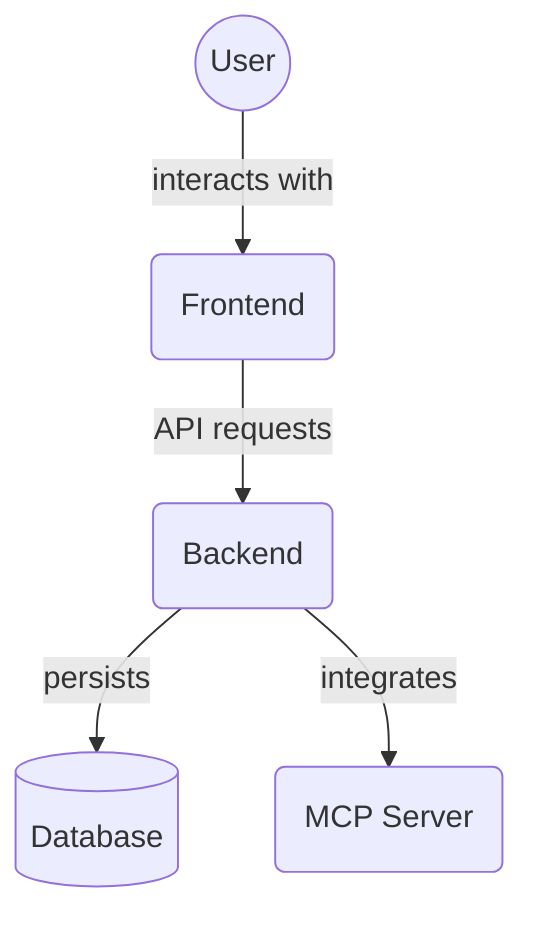

[](https://github.com/YOUR_USERNAME/YOUR_REPOSITORY/actions/workflows/ci.yml)
[](https://badge.fury.io/js/mcp-project-manager-cli)
[](https://opensource.org/licenses/ISC)

# MCP Project Manager Suite

An open-source, full-stack suite for collaborative project management, empowering human users and AI agents to manage, automate, and execute complex projects—end-to-end. Built with a FastAPI backend, a Next.js/Chakra UI frontend, and integrated with the Model Context Protocol (MCP) for advanced agentic capabilities.

## 🚀 Quick Start

### **One-Command Development Setup**
```bash
# Clone and setup (if needed), then:
python start_system.py
```

This will automatically:
- ✅ Launch the FastAPI backend and Next.js frontend together
- ✅ Clear ports 8000 and 3000
- ✅ Open API docs at http://localhost:8000/docs

### **Alternative Launch Methods**
```bash
dev_launcher.bat              # Windows batch script
node dev_launcher.js          # Cross-platform Node.js
npm run dev                   # NPM script
powershell dev_launcher.ps1   # PowerShell (Windows)
```

See [`DEV_LAUNCHER_GUIDE.md`](./DEV_LAUNCHER_GUIDE.md) for complete setup instructions.

## Tech Stack

*   **Backend:**
    *   FastAPI (Python 3.x)
    *   SQLAlchemy (ORM) - *Used for Project Management, Agent Roles, and Knowledge Graph/Memory*
    *   Pydantic (Data Validation)
    *   Alembic (Database Migrations)
    *   SQLite (Default) / PostgreSQL (Optional) - *Used for Project Management, Agent Roles, and Knowledge Graph/Memory*
    *   Uvicorn (ASGI Server)
    *   `python-dotenv` (Environment Variables)
    *   MCP Server Integration (`fastapi-mcp`)
*   **Frontend:**
    *   Next.js (React Framework)
    *   TypeScript
    *   Chakra UI (Component Library & Styling)
    *   Zustand (State Management)
    *   `fetch` API / React Query (for backend communication)
*   **Development & CLI:**
    *   Node.js & npm
    *   Python Virtual Environment (`venv`)
    *   Commander.js (CLI Framework)
*   **Agent & Rules Engine:**
    *   Model Context Protocol (MCP)
    *   `.cursor` rules (.mdc files)

## Project Structure

```
project-manager/
├── .cursor/                # MCP rules and agent configurations
│   ├── rules/              # Agent rule files (.mdc)
│   └── ...
├── backend/                # FastAPI backend service. See backend/README.md for details.
│                           # (Subdirectories like alembic/, tests/ also have READMEs)
│   ├── .venv/              # Python virtual environment
│   ├── alembic/            # Alembic migration scripts
│   ├── crud/               # Database CRUD functions
│   │   └── memory.py       # CRUD operations for memory models
│   ├── database.py         # Database engine, session, Base
│   ├── main.py             # FastAPI application, routes, MCP integration
│   ├── models.py           # SQLAlchemy ORM models (*Updated with memory models*)
│   ├── routers/            # API Routers
│   │   └── memory.py       # Endpoints for the memory service
│   ├── schemas.py          # Pydantic schemas for API data (*Updated with memory schemas*)
│   ├── tests/              # Backend tests
│   ├── pyproject.toml      # Project metadata and dependencies (or requirements.txt)
│   └── sql_app.db          # SQLite database file
│   └── .env                # Optional: for PostgreSQL connection details
├── frontend/               # Next.js frontend application. See frontend/README.md for details.
│                           # (Most subdirectories under frontend/src/ have detailed READMEs)
│   ├── public/             # Static assets (images, favicons)
│   ├── src/
│   │   ├── app/            # Next.js App Router pages
│   │   ├── components/     # React components
│   │   ├── contexts/       # React contexts (e.g., ThemeContext)
│   │   ├── theme/          # Chakra UI theme configuration (index.ts)
│   │   ├── services/       # API communication logic
│   │   └── store/          # Zustand state management
│   ├── next.config.mjs     # Next.js configuration
│   ├── package.json        # Node dependencies
│   ├── tsconfig.json       # TypeScript configuration
├── cli.js                  # Main CLI script for the suite (core of mcp-project-manager-cli)
├── BRAND_ASSETS_GUIDE.md   # Branding guidelines and asset paths
└── README.md               # This file
```

## Features (Overview)

*   **Collaborative Project Management:** Enables seamless collaboration between human users and AI agents.
*   **MCP Integration:** Leverages the Model Context Protocol for rule-driven agent orchestration, automation, and task delegation.
*   **Agentic Capabilities:** Define and utilize different AI agents for specialized tasks within projects.
*   **Knowledge Graph / Memory Service:**
    *   Provides a centralized, database-backed store for structured information.
    *   Enables agents and potentially human users to store, retrieve, and relate entities, observations, and facts.
    *   Powers enhanced contextual understanding and persistent memory for agents.
*   **Unified Interface:** Modern WebGUI (Next.js/Chakra UI) for human interaction, monitoring, and guidance.
*   **Comprehensive Task Management:** Create, view, update, delete, assign, archive, and unarchive tasks and subtasks.
*   **Project Organization:** Group tasks into projects with descriptions and statuses.
*   **Task Dependencies:** Model relationships between tasks (predecessors and successors).
*   **Task File Associations:** Link relevant files (Memory Entities) directly to tasks.
*   **Flexible Filtering:** Filter and search tasks by various criteria.
*   **CLI for Easy Setup & Management:** One-command setup and an `npx`-runnable CLI to manage the entire suite.

## Advanced Features

Beyond basic task and project management, the MCP Project Manager Suite offers advanced features to enhance collaboration, automation, and knowledge management:

*   **Task Dependencies:** Define relationships between tasks, ensuring that tasks are completed in the correct order. This helps visualize project flow and identify bottlenecks.
*   **Task File Associations:** Link relevant files (such as design documents, code snippets, or research notes) directly to tasks using the integrated Memory service. This keeps all task-related information easily accessible.
*   **Task Archiving:** Archive completed or irrelevant tasks to keep your project views clean without permanently deleting historical data. Archived tasks can be easily unarchived if needed.
*   **System-Wide Task API:** A robust API layer (built with FastAPI) allows external tools and AI agents to interact with the task management system programmatically. This enables deep automation and integration with other services.

## Setup and Running

While the `mcp-project-manager-cli` (see below) is the recommended way to get started, you can also set up and run the backend and frontend services manually.

### Prerequisites

*   Python 3.8+
*   Node.js 18.x+ and npm

### 1. Backend Setup (FastAPI)

```bash
# Navigate to the backend directory
cd backend

# Create and activate a Python virtual environment
# On Windows:
python -m venv .venv
.\.venv\Scripts\activate
# On macOS/Linux:
# python3 -m venv .venv
# source .venv/bin/activate

# Install dependencies
# The cli.js installs these directly: fastapi, uvicorn, sqlalchemy, alembic, psycopg2-binary
# Ensure these are captured in a requirements.txt or pyproject.toml for manual setup if preferred.
pip install fastapi uvicorn sqlalchemy alembic psycopg2-binary python-dotenv

# (Optional) Configure PostgreSQL
# 1. Create a .env file in the backend/ directory
# 2. Add your PostgreSQL connection details:
#    DATABASE_USER=your_db_user
#    DATABASE_PASSWORD=your_db_password
#    DATABASE_HOST=your_db_host (e.g., localhost)
#    DATABASE_PORT=your_db_port (e.g., 5432)
#    DATABASE_NAME=your_db_name
# 3. Uncomment the PostgreSQL section in backend/database.py
#    and comment out the SQLite section.

# Run the FastAPI development server
# It will automatically create the sql_app.db (SQLite) if it doesn't exist
uvicorn main:app --reload --host 0.0.0.0 --port 8000
```

The backend API will be available at `http://localhost:8000`.
Interactive API documentation (Swagger UI) is available at `http://localhost:8000/docs`.

### 2. Frontend Setup (Next.js)

```bash
# Navigate to the frontend directory (from the project root)
cd frontend

# Install dependencies
npm install

# Run the Next.js development server
npm run dev
```

The frontend application will be available at `http://localhost:3000`.

### **Windows Development Tip**

A `dev_launcher.bat` script is available in the project root. This batch file attempts to clear ports **8000** (for the backend) and **3000** (for the frontend), then starts the backend server with `uvicorn` and the frontend with `npm run dev` in separate command windows. Run it by double-clicking the file or executing `dev_launcher.bat` from the project root.


## How It Works

1.  The **MCP Project Manager CLI** (`cli.js`) orchestrates the setup and launching of all services.
2.  The **FastAPI backend** (Python) serves the main API, manages database interactions (via SQLAlchemy and Pydantic), and integrates the MCP server (`fastapi-mcp`) for agentic operations based on `.cursor/rules`. *It now also includes a dedicated Knowledge Graph/Memory service for storing and retrieving structured information.*
3.  The **Next.js frontend** (TypeScript, Chakra UI) provides a responsive and themeable user interface for project and task management, interacting with the backend API.
4.  **Zustand** is used for client-side state management in the frontend.
5.  **Chakra UI** provides the component library and styling, ensuring a consistent and modern look and feel with light/dark mode support.
6.  Data is stored in an **SQLite database** by default, with PostgreSQL as an option.
7.  **Alembic** is used for database schema migrations.

# Project Manager CLI

**MCP + WebGUI = Collaborative Agent & Human Project Management Platform**

> Where agents and humans manage projects—together.

Project Manager CLI is a next-generation platform that seamlessly combines autonomous agent orchestration (via the Model Context Protocol, MCP) with a modern web-based GUI. It empowers both human users and AI agents to collaboratively manage, automate, and execute complex projects—end-to-end.

## Prerequisites

- Node.js (v18.x or higher recommended, v14 minimum)
- Python (v3.8 or higher)
- npm (comes with Node.js)

## Installation

You can run the MCP Project Manager CLI directly using npx. This command now runs the fully bundled application:

```bash
npx mcp-project-manager-cli start
```

This is the recommended way for most users to start the Project Manager Suite, as it ensures you are running the pre-built and tested version of the application.

Alternatively, you can install it globally:

```bash
npm install -g mcp-project-manager-cli
mcp-project-manager start
```
This will also run the bundled application.

## Features

- One-command installation and startup
- Automatic dependency installation for both backend and frontend
- Auto-restart on failure
- Cross-platform support (Windows, macOS, Linux)
- Real-time logging with color-coded output
- Automatic port management

## What it Does

When you run `npx mcp-project-manager-cli start` or `mcp-project-manager start`:

1. **Checks for Prerequisites:** Verifies that compatible versions of Node.js and Python are available on your system.
2. **Runs Bundled Application:** Executes the pre-built Project Manager Suite. This includes:
    *   The FastAPI backend server.
    *   The Next.js frontend application.
3. **No Local Setup Needed:** Unlike previous versions or manual setup, this command *does not* perform local dependency installations (npm install for frontend, pip install for backend) or Python virtual environment creation in your current directory. These steps are handled during the bundling of the `mcp-project-manager-cli` package itself.
4. **Manages Services:** Starts both backend and frontend services with auto-restart capabilities.
5. **Provides Logging:** Offers real-time, color-coded logging for both services.
6. **Port Management:** Uses default ports (Backend: 8000, Frontend: 3000) and may offer options for custom ports (check `mcp-project-manager start --help`).

The key change is that `start` now directly runs the application, simplifying setup and ensuring a consistent environment. For development or contributions to the suite itself, refer to the manual setup instructions earlier in this README.

## Configuration

The services will run on the following default ports:
- Backend: http://localhost:8000
- Frontend: http://localhost:3000

## Troubleshooting

If you encounter any issues:

1. Make sure both Node.js and Python are installed and in your PATH
2. Check if the ports 8000 and 3000 are available
3. If services fail to start, check the logs for detailed error messages

## System Validation & Testing

Use `final_integration.py` to verify the entire suite or run integration tests.

```bash
# Validate only
python final_integration.py --mode validate

# Integration tests only
python final_integration.py --mode test

# Run both validation and tests (default)
python final_integration.py --mode all
```

## License

ISC

## Directory Contents Overview

This is the root directory of the MCP Project Manager Suite. It contains top-level configuration files, build scripts, documentation, and the main entry points for the backend and frontend applications.

Key files and directories:

*   `backend/`: Contains the FastAPI backend application code.
*   `frontend/`: Contains the Next.js frontend application code.
*   `README.md`: This file, providing a high-level overview of the project.
*   `package.json`: Node.js package file, managing frontend dependencies and scripts.
*   `package-lock.json`: Records the exact versions of frontend dependencies.
*   `dev_launcher.*`: Scripts for easily launching the development environment.
*   `*.md`: Various top-level documentation files (e.g., guides, reports).
*   `.gitignore`: Specifies intentionally untracked files that Git should ignore.
*   `.npmignore`: Specifies files that should be ignored when publishing to npm.
*   `LICENSE`: Project license file.
*   `sql_app.db`: Default SQLite database file (generated on first run).
*   `.github/`: Contains GitHub Actions workflows for CI/CD.
*   `docs/`: Placeholder for additional documentation (currently empty).
*   `.cursor/`: Contains MCP rules and agent configurations.

## Architecture Diagram


<!-- File List Start -->
## File List

- `.cursorignore`
- `.gitignore`
- `.npmignore`
- `AEROSPACE_GRADE_DOCUMENTATION.md`
- `AGENTS.MD`
- `BACKEND_FRONTEND_ALIGNMENT_REPORT.md`
- `CLEANUP_SUMMARY.md`
- `CONTRIBUTING.md`
- `DEV_LAUNCHER_COMPLETE.md`
- `DEV_LAUNCHER_GUIDE.md`
- `LICENSE`
- `SYSTEM_GUIDE.md`
- `dev_launcher.bat`
- `dev_launcher.js`
- `dev_launcher.ps1`
- `eslint_report.json`
- `final_integration.py`
- `image-dark.png`
- `image-light.png`
- `package-lock.json`
- `package.json`
- `run_backend.py`
- `run_core_backend.py`
- `run_minimal_backend.py`
- `run_production_backend.py`
- `sql_app.db`
- `start_system.py`
- `test_openapi.py`
- `validate_alignment.py`
- `validate_frontend.js`

<!-- File List End -->

