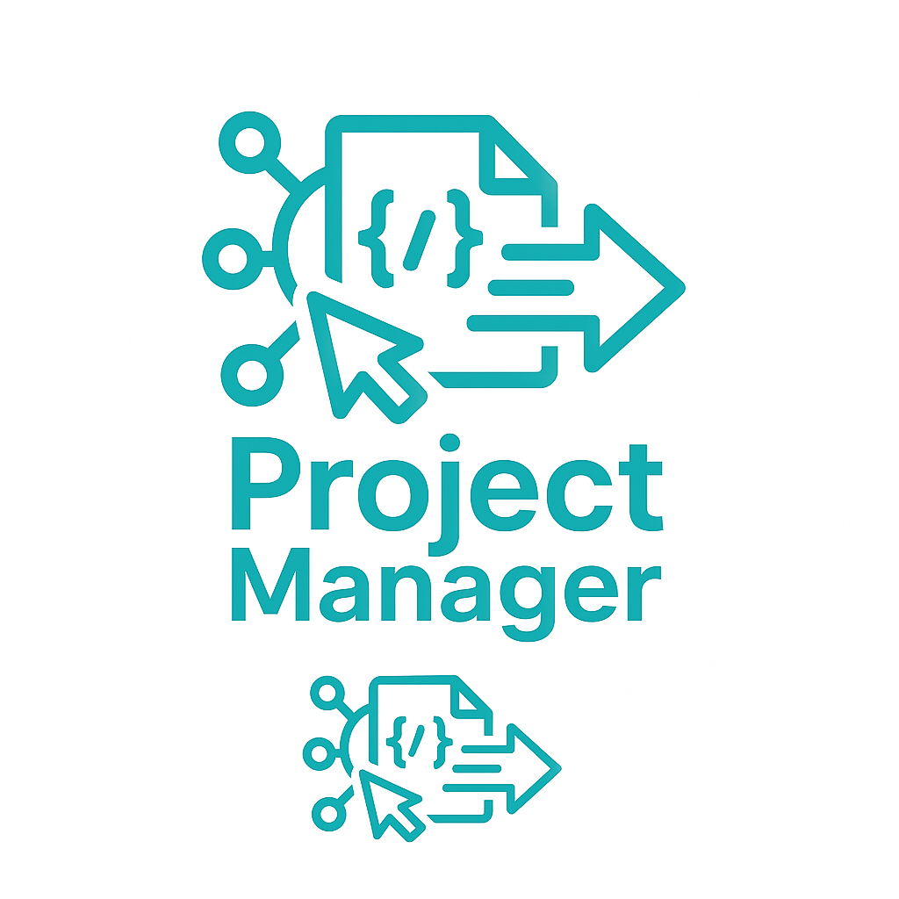
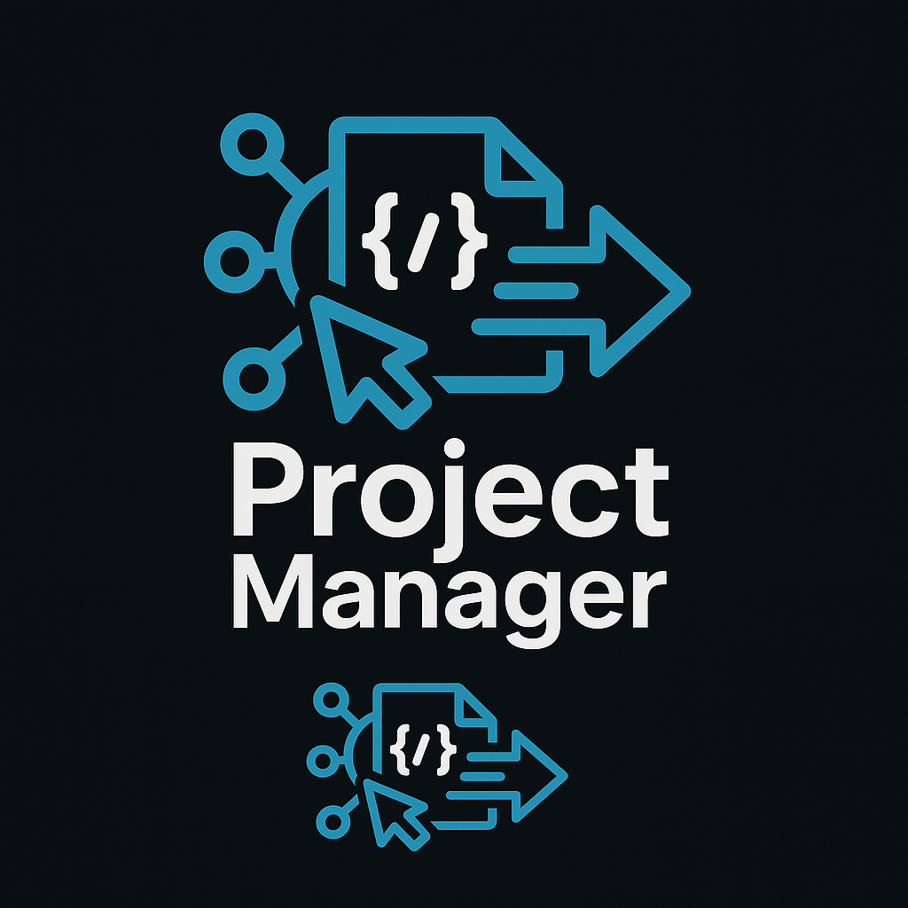

Here is the **full, resolved `README.md`** file with all sections and previously conflicting parts properly merged:

````markdown
[](https://github.com/m0st4f4-hub/MCP-ProjectManager/actions/workflows/ci.yml)
[](https://badge.fury.io/js/mcp-project-manager-cli)
[](https://opensource.org/licenses/ISC)

# MCP Project Manager Suite

An open-source, full-stack suite for collaborative project management, empowering human users and AI agents to manage, automate, and execute complex projects—end-to-end. Built with a FastAPI backend, a Next.js/Chakra UI frontend, and integrated with the Model Context Protocol (MCP) for advanced agentic capabilities.

---

## 🚀 Quick Start

### One-Command Development Setup

```bash
python start_system.py
````

This will automatically:

* ✅ Launch the FastAPI backend and Next.js frontend together
* ✅ Clear ports 8000 and 3000
* ✅ Open API docs at [http://localhost:8000/docs](http://localhost:8000/docs)

### Alternative Launch Methods

```bash
dev_launcher.bat              # Windows batch script
node dev_launcher.js          # Cross-platform Node.js
npm run dev                   # NPM script
powershell dev_launcher.ps1   # PowerShell (Windows)
```

### Database Migrations

Apply pending migrations using the CLI:

```bash
node cli.js migrate
```

See [`DEV_LAUNCHER_GUIDE.md`](./DEV_LAUNCHER_GUIDE.md) for complete setup instructions.
For an overview of all dev scripts, see [`DEV_SCRIPTS.md`](./DEV_SCRIPTS.md).
For required environment variables and defaults, check [`ENVIRONMENT_SETUP.md`](./ENVIRONMENT_SETUP.md).
If you're contributing, read the [CONTRIBUTING.md](./CONTRIBUTING.md) guide.

---

## 🧱 Tech Stack

* **Backend:** FastAPI, SQLAlchemy, Pydantic, Alembic, SQLite/PostgreSQL
* **Frontend:** Next.js, Chakra UI, TypeScript, Zustand
* **Orchestration & Agents:** MCP Server, `.cursor` rules, fastapi-mcp
* **Dev & CLI:** Node.js, Python, Commander.js

---

## 📁 Project Structure

```text
project-manager/
├── backend/                # FastAPI service
├── frontend/               # Next.js + Chakra UI app
├── .cursor/                # MCP rules
├── cli.js                  # Main CLI entry
├── dev_launcher.*          # Multi-platform launchers
├── start_system.py         # One-command setup
├── *.md                    # Docs
├── sql_app.db              # SQLite DB (default)
├── .github/                # CI/CD workflows
```

---

## ✅ Features

* Human-agent task collaboration
* Full task/project lifecycle management
* Task dependencies, filtering, archiving
* Memory service with `/api/memory/ingest-url` and `/api/memory/ingest-text`
* Integrated MCP agentic automation
* CLI-first UX with automatic backend/frontend orchestration
* Auto-restoring services and port management

---

## 🆕 New Pages

- **Project Detail**: `/projects/<id>` displays a single project's tasks using `ProjectDetail`.
- **Templates**: `/templates` with subpages for creating (`/templates/new`) and editing templates.
- **User Roles**: `/user-roles` page to assign and manage roles.
- **Memory Graph**: `/memory/graph` visualizes the knowledge graph.
- **Metrics**: `/mcp-tools/metrics` shows runtime metrics.

## 🪝 Custom Hooks

- `useEventSource(path, onMessage)` – Subscribe to `/mcp-tools/stream` events.
  ```tsx
  const { lastEvent } = useEventSource('/mcp-tools/stream', e => console.log(e));
  ```
- `useProjectData(projectId)` – Fetch a project and its tasks.
  ```tsx
  const { project, tasks, refresh } = useProjectData(id);
  ```
- `useFilteredTasks(tasks, filters)` – Memoized task filtering.
- `useFilteredProjects(projects, filters, activeProject)` – Sync project lists with task view.

## 📸 UI Screenshots




---

## 🖥️ Manual Setup (Optional)

### Backend

```bash
cd backend
python -m venv .venv
source .venv/bin/activate   # or .\.venv\Scripts\activate on Windows
pip install -r requirements.txt
uvicorn main:app --reload
```

### Frontend

```bash
cd frontend
npm install
npm run dev
```

### Makefile Commands

The root `Makefile` provides shortcuts for common tasks:

```bash
make migrate   # apply database migrations
make format    # auto-fix Python and frontend code style
```

---

## 🧪 Testing

### Backend

```bash
cd backend
pytest
```

### Frontend

```bash
cd frontend
npm test
```

### Type Checking

```bash
npm run type-check
```

---

## 🔍 System Validation & Tests

```bash
python final_integration.py --mode all
```
This runs a comprehensive validation including checks for project template and agent rule features.

---

## 📜 License

ISC

---

## 📂 File List

<!-- File List Start -->
## File List

- `.cursorignore`
- `.flake8`
- `.gitignore`
- `.npmignore`
- `.pre-commit-config.yaml`
- `.prettierrc.json`
- `AEROSPACE_GRADE_DOCUMENTATION.md`
- `AGENTS.MD`
- `AUTH_SETUP.md`
- `BACKEND_FRONTEND_ALIGNMENT_REPORT.md`
- `CLEANUP_SUMMARY.md`
- `CONTRIBUTING.md`
- `DEV_LAUNCHER_COMPLETE.md`
- `DEV_LAUNCHER_GUIDE.md`
- `DEV_SCRIPTS.md`
- `LICENSE`
- `Makefile`
- `PROMETHEUS_GRAFANA_SETUP.md`
- `SYSTEM_GUIDE.md`
- `cli.js`
- `dev_launcher.bat`
- `dev_launcher.js`
- `dev_launcher.ps1`
- `final_integration.py`
- `image-dark.png`
- `image-light.png`
- `package-lock.json`
- `package.json`
- `run_backend.py`
- `start_system.py`
- `validate_alignment.py`
- `validate_frontend.js`

<!-- File List End -->


---

## 🧠 Architecture Diagram


---

## 💬 Contributing

Please read [CONTRIBUTING.md](./CONTRIBUTING.md) for pre-commit hooks, commit style, and test expectations.

```

Let me know if you'd like a downloadable version or if you want all sections refactored to match internal documentation styling guidelines.
```
