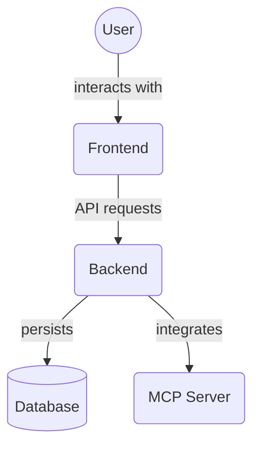

# Task Manager Backend - Server & Testing Guide

## 🚀 Quick Start

### Start the Development Server

**From the project root directory (`D:\mcp\task-manager`):**

```bash
cd D:\mcp\task-manager
backend\.venv\Scripts\python.exe -m uvicorn backend.main:app --host 0.0.0.0 --port 8000 --reload
```

The server will start and you should see:
- ✅ Database tables being checked/initialized
- ✅ "Application startup complete."
- ✅ Server running on `http://0.0.0.0:8000`

### Access the API

- **API Documentation**: http://localhost:8000/docs
- **Interactive API**: http://localhost:8000/redoc
- **Health Check**: http://localhost:8000/health
- **Root Endpoint**: http://localhost:8000/

## 🧪 Running Tests

### Run Individual Test Suites

**From the project root directory (`D:\mcp\task-manager`):**

```bash
# Run async example tests
backend\.venv\Scripts\pytest.exe backend\tests\test_async_example.py -v

# Run CRUD tests
backend\.venv\Scripts\pytest.exe backend\tests\test_projects_crud.py backend\tests\test_tasks_crud.py backend\tests\test_agents_crud.py -v

# Run specific test files
backend\.venv\Scripts\pytest.exe backend\tests\test_comments_crud.py -v
backend\.venv\Scripts\pytest.exe backend\tests\test_audit_logs_crud.py -v
```

### Run All Working Tests

```bash
# From the project root
backend\.venv\Scripts\pytest.exe backend\tests\test_async_example.py backend\tests\test_projects_crud.py backend\tests\test_tasks_crud.py backend\tests\test_agents_crud.py backend\tests\test_comments_crud.py backend\tests\test_audit_logs_crud.py -v
```
## 📁 Project Structure

```
D:\mcp\task-manager\
├── backend\                    # Backend application
│   ├── .env                    # Environment configuration ✅
│   ├── .venv\                  # Virtual environment ✅
│   ├── main.py                 # FastAPI application entry point ✅
│   ├── database.py             # Database configuration ✅
│   ├── requirements.txt        # Python dependencies ✅
│   ├── pytest.ini             # Test configuration ✅
│   ├── alembic.ini             # Database migrations config
│   │
│   ├── config\                 # Configuration modules
│   │   ├── __init__.py
│   │   └── app_config.py       # Settings and environment loading ✅
│   │
│   ├── models\                 # SQLAlchemy data models ✅
│   ├── schemas\                # Pydantic schemas
│   ├── crud\                   # Database operations
│   ├── services\               # Business logic
│   ├── routers\                # API endpoints
│   ├── middleware\             # Request/response middleware
│   ├── tests\                  # Test files ✅
│   └── alembic\                # Database migration files
│
├── frontend\                   # Frontend application
└── (run commands from here)    # ← Important!
```

## 🔧 Configuration

### Environment Variables (`.env`)

The backend uses these environment variables (located in `backend\.env`):

```env
DATABASE_URL=sqlite+aiosqlite:///./sql_app.db
TEST_DATABASE_URL=sqlite+aiosqlite:///./test.db
SECRET_KEY=mysecretkey
ALGORITHM=HS256
ACCESS_TOKEN_EXPIRE_MINUTES=30
DEBUG=True
```

### Database

- **Production DB**: `backend\sql_app.db` (SQLite with async support)
- **Test DB**: `backend\test.db` (Separate database for tests)
- **Migrations**: Use Alembic for schema changes
## 🛠️ Development Workflow

### 1. Make Code Changes
Edit files in the appropriate directories:
- **Models**: `backend\models\`
- **API Routes**: `backend\routers\`
- **Business Logic**: `backend\services\`
- **Database Operations**: `backend\crud\`

### 2. Test Your Changes
```bash
# Run relevant tests
backend\.venv\Scripts\pytest.exe backend\tests\test_[module_name].py -v

# Start the server to test manually
backend\.venv\Scripts\python.exe -m uvicorn backend.main:app --host 0.0.0.0 --port 8000 --reload
```

### 3. Database Changes
If you modify models, create and run migrations:
```bash
cd backend
.venv\Scripts\alembic.exe revision --autogenerate -m "Description of changes"
.venv\Scripts\alembic.exe upgrade head
```

## ✅ What's Working

- ✅ **Server Startup**: FastAPI server starts successfully
- ✅ **Database**: SQLite with async support (aiosqlite)
- ✅ **Configuration**: Environment variables loaded correctly
- ✅ **Tests**: Multiple test suites passing
- ✅ **API Documentation**: Auto-generated Swagger/OpenAPI docs
- ✅ **Hot Reload**: Code changes trigger automatic server restart
- ✅ **Memory Service / Knowledge Graph**: Centralized storage for entities and relationships.
- ✅ **Extended Task API**: Endpoints for task dependencies, file associations, archiving, and unarchiving.
- ✅ **Database Migrations**: Alembic support updated for Memory Service models.
- ✅ **Task Listing**: Global task listing available at `/api/v1/tasks` with optional `project_id` and pagination. Project-specific listing at `/api/v1/projects/{project_id}/tasks`.
- ✅ **Task Comments**: API for listing and adding comments to tasks is fully functional.
- ✅ **Project Members**: API for managing project members (add, remove, list) is fully functional.
## 🔍 Troubleshooting

### Server Won't Start
1. Make sure you're in the correct directory (`D:\mcp\task-manager`)
2. Check that the virtual environment exists (`backend\.venv\`)
3. Verify the `.env` file has all required variables

### Tests Failing
1. Make sure the test database is not locked
2. Run tests individually to isolate issues
3. Check that imports work correctly

### Import Errors
- The project is designed to run from the root directory
- All imports should be relative to the `backend` package
- Don't run files directly from the backend directory

## 🎯 Key Commands Reference

```bash
# Start server (from root)
backend\.venv\Scripts\python.exe -m uvicorn backend.main:app --host 0.0.0.0 --port 8000 --reload

# Run tests (from root)
backend\.venv\Scripts\pytest.exe backend\tests\test_async_example.py -v

# Check requirements
backend\.venv\Scripts\pip.exe list

# Install new dependencies
backend\.venv\Scripts\pip.exe install package_name
backend\.venv\Scripts\pip.exe freeze > backend\requirements.txt
```

---

**Remember**: Always run commands from the project root directory (`D:\mcp\task-manager`) for correct module resolution!

## Directory Contents Overview

This directory contains the FastAPI backend application for the MCP Project Manager Suite. It houses the API logic, database interactions, business services, and configuration.

Key files and directories:

*   `alembic/`: Database migration scripts.
*   `config/`: Application configuration settings.
*   `crud/`: Database Create, Read, Update, and Delete (CRUD) operations.
*   `middleware/`: FastAPI middleware for request processing.
*   `models/`: SQLAlchemy ORM models defining database schema.
*   `routers/`: FastAPI routers defining API endpoints.
*   `schemas/`: Pydantic schemas for data validation and serialization.
*   `services/`: Business logic and service layer.
*   `tests/`: Backend test suites (unit and integration).
*   `.venv/`: Python virtual environment for dependencies.
*   `main.py`: Main FastAPI application entry point.
*   `database.py`: Database connection and session setup.
*   `requirements.txt`: Python project dependencies.
*   `auth.py`: Authentication related code.

## Architecture Diagram


<!-- File List Start -->
## File List

- `.env`
- `.flake8`
- `__init__.py`
- `alembic.ini`
- `auth.py`
- `check_routes.py`
- `comprehensive_flake8_fixer.py`
- `comprehensive_indent_fix.py`
- `database.py`
- `debug_tables.py`
- `debug_test_db.py`
- `enums.py`
- `init_db.py`
- `main.py`
- `middleware.py`
- `pytest.ini`
- `quick_fix_project_service.py`
- `quick_indent_fix.py`
- `requirements.txt`
- `security.py`
- `test_app_import.py`
- `test_basic_imports.py`
- `test_endpoints.py`
- `test_individual_models.py`
- `test_lazy_imports.py`
- `test_openapi.json`
- `test_router_imports.py`
- `validation.py`

<!-- File List End -->


## FastAPI-MCP Documentation
Local reference docs for [FastAPI-MCP](https://github.com/tadata-org/fastapi_mcp) are available in `docs/fastapi_mcp/`.

## FastAPI Documentation
A local snapshot of the FastAPI tutorial is available in `docs/fastapi/` for offline reference. See `docs/fastapi/index.md` and the `tutorial` subfolder.
