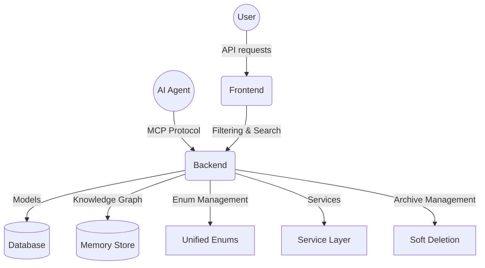

# MCP Project Manager Backend - API & Services

## 🚀 Quick Start

### Start the Development Server

**From the project root directory (`D:\mcp\task-manager`):**

```bash
cd D:\mcp\task-manager
backend\.venv\Scripts\python.exe -m uvicorn backend.main:app --host 0.0.0.0 --port 8000 --reload
```

The server will start and you should see:
- ✅ Database migrations applied
- ✅ "Application startup complete."
- ✅ Server running on `http://0.0.0.0:8000`
- ✅ **46 API routes loaded successfully**

### Access the API

- **API Documentation**: http://localhost:8000/docs
- **Interactive API**: http://localhost:8000/redoc
- **Health Check**: http://localhost:8000/health
- **Root Endpoint**: http://localhost:8000/
- **Schema Snapshot**: `openapi.json` in this folder

## 🏗️ Architecture

Our backend features a unified architecture with filtering, standardized response models, and enum management.

### 📊 API Endpoints (46 Routes)

#### 🎯 Core Endpoints

**Projects** (`/api/v1/projects/`)
- `GET /` - List projects with filtering (status, priority, visibility, search, archived, owner)
- `POST /` - Create new project with validation
- `GET /{id}` - Get project details with relationships
- `PUT /{id}` - Update project with enum validation
- `POST /{id}/archive` - Archive project with audit logging
- `POST /{id}/unarchive` - Unarchive project
- `DELETE /{id}` - Delete project (admin only)

**Tasks** (`/api/v1/projects/{project_id}/tasks/`)
- `GET /` - List tasks with filtering (agent, status, search, archived, sorting)
- `POST /` - Create task with project association
- `GET /{task_number}` - Get task by project-specific number
- `PUT /{task_number}` - Update task with status validation
- `POST /{task_number}/archive` - Archive task
- `POST /{task_number}/unarchive` - Unarchive task
- `DELETE /{task_number}` - Delete task

**Users** (`/api/v1/users/`)
- `GET /` - List users with role-based filtering (role, active status, search)
- `POST /` - Create user (admin only)
- `GET /{id}` - Get user details
- `PUT /{id}` - Update user (self or admin)
- `DELETE /{id}` - Archive user (admin only)

**Agents** (`/api/v1/agents/`)
- `GET /` - List agents with status filtering (status, search, archived)
- `POST /` - Register new agent
- `GET /{id}` - Get agent details
- `PUT /{id}` - Update agent
- `POST /{id}/archive` - Archive agent
- `POST /{id}/unarchive` - Unarchive agent

**Enums** (`/api/v1/enums/`)
- `GET /project-status` - Available project statuses
- `GET /project-priority` - Available project priorities 
- `GET /project-visibility` - Available visibility levels
- `GET /project-member-role` - Available member roles
- `GET /task-status` - Available task statuses

#### 🔧 Additional Features

**Memory & Knowledge Graph** (`/api/v1/memory/`)
- `POST /ingest/upload` - Upload files to knowledge graph
- `POST /ingest-url` - Ingest content from URLs
- `POST /ingest-text` - Process text content
- `GET /entities/graph` - Retrieve knowledge graph with pagination

**MCP Tools** (`/mcp-tools/`)
- Agent automation and management endpoints
- Metrics and monitoring capabilities
- Stream event subscription

## 🧪 Running Tests

### Run Individual Test Suites

**From the project root directory (`D:\mcp\task-manager`):**

```bash
# Run async example tests
backend\.venv\Scripts\pytest.exe backend\tests\test_async_example.py -v

# Run CRUD tests
backend\.venv\Scripts\pytest.exe backend\tests\test_projects_crud.py backend\tests\test_tasks_crud.py backend\tests\test_agents_crud.py -v

# Run specific test files
backend\.venv\Scripts\pytest.exe backend\tests\test_comments_crud.py -v
backend\.venv\Scripts\pytest.exe backend\tests\test_audit_logs_crud.py -v
```

### Run All Working Tests

```bash
# From the project root
backend\.venv\Scripts\pytest.exe backend\tests\test_async_example.py backend\tests\test_projects_crud.py backend\tests\test_tasks_crud.py backend\tests\test_agents_crud.py backend\tests\test_comments_crud.py backend\tests\test_audit_logs_crud.py -v
```

## 🧺 Linting

Run `flake8` before committing to ensure Python code meets the project style.

```bash
cd backend
flake8 .
```

Fix any issues reported. The helper script `comprehensive_flake8_fixer.py` can
automatically clean common violations.

## 📁 Project Structure

```
D:\mcp\task-manager\backend\
├── models/                     # Database Models
│   ├── base.py                 # Base model with common functionality
│   ├── project.py              # Project model with enums
│   ├── task.py                 # Task model with statuses
│   ├── user.py                 # User model with role relationships
│   ├── agent.py                # Agent model with status management
│   └── __init__.py             # Model exports
│
├── schemas/                    # Pydantic Validation Schemas
│   ├── project.py              # Project schemas with enum validation
│   ├── task.py                 # Task schemas with status validation
│   ├── user.py                 # User schemas with role support
│   ├── agent.py                # Agent schemas with filtering
│   ├── api_responses.py        # Standardized response models
│   └── __init__.py             # Schema exports
│
├── services/                   # Business Logic
│   ├── project_service.py      # Filtering & pagination
│   ├── task_service.py         # Task management
│   ├── user_service.py         # Role-based user filtering
│   ├── agent_service.py        # Agent lifecycle management
│   ├── exceptions.py           # Exception handling
│   └── utils.py                # Service utilities
│
├── routers/                    # API Endpoints
│   ├── projects/               # Project management endpoints
│   │   ├── core.py             # Project CRUD with filtering
│   │   ├── members.py          # Project member management
│   │   ├── files.py            # File associations
│   │   └── planning.py         # Project planning features
│   ├── tasks/                  # Task management endpoints
│   │   ├── core/               # Core task operations
│   │   └── dependencies/       # Task dependency management
│   ├── users/                  # User management endpoints
│   │   └── core/               # User operations
│   ├── agents/                 # Agent management endpoints
│   │   └── core.py             # Agent operations
│   ├── enums.py                # Enum value endpoints
│   ├── memory/                 # Knowledge graph endpoints
│   └── mcp/                    # MCP tool endpoints
│
├── crud/                       # Database Operations
├── middleware/                 # Request/response middleware
├── config/                     # Configuration management
├── tests/                      # Test suites
├── alembic/                    # Database migrations
│
├── enums.py                    # Enum Definitions
├── main.py                     # FastAPI application entry point
├── database.py                 # Database configuration
├── auth.py                     # Authentication & authorization
├── validation.py               # Custom validation helpers
└── requirements.txt            # Python dependencies
```

## 🎯 Key Features

### ✅ Unified Enum System

**Project Status**: `active`, `completed`, `paused`, `archived`, `cancelled`
**Project Priority**: `low`, `medium`, `high`, `critical`
**Project Visibility**: `private`, `team`, `public`
**Task Status**: 18 workflow statuses

All enums are centralized in `enums.py` and available via `/api/v1/enums/` endpoints.

### ✅ Filtering & Search

**Projects**: Filter by status, priority, visibility, owner, archived state + search by name/description
**Tasks**: Filter by agent, status, search terms, archived state with sorting support
**Users**: Filter by role, active status + search across username/email/full_name
**Agents**: Filter by status, capabilities, archived state + search

### ✅ Response Models

All endpoints use standardized response models:
- `DataResponse[T]` - Single item responses with metadata
- `ListResponse[T]` - List responses with pagination info
- Error handling and status codes

### ✅ Archive Management

Soft deletion with restore capabilities across all major entities:
- Projects: `/projects/{id}/archive` & `/projects/{id}/unarchive`
- Tasks: `/tasks/{task_number}/archive` & `/tasks/{task_number}/unarchive`
- Agents: `/agents/{id}/archive` & `/agents/{id}/unarchive`

## 🔧 Configuration

### Environment Variables (`.env`)

Copy `backend/.env.example` to `backend/.env` and update the values as needed:

```env
DATABASE_URL=sqlite+aiosqlite:///./sql_app.db
TEST_DATABASE_URL=sqlite+aiosqlite:///./test.db
SECRET_KEY=mysecretkey
ALGORITHM=HS256
ACCESS_TOKEN_EXPIRE_MINUTES=30
DEBUG=True
CORS_ORIGINS="http://localhost:3000,http://example.com"
DB_POOL_SIZE=5
DB_MAX_OVERFLOW=10
DB_POOL_TIMEOUT=30
DB_POOL_RECYCLE=1800
DB_POOL_PRE_PING=true
```

### Database

- **Production DB**: `backend\sql_app.db` (SQLite with async support)
- **Test DB**: `backend\test.db` (Separate database for tests)
- **Migrations**: Use Alembic for schema changes

## 🛠️ Development Workflow

### 1. Make Code Changes
Edit files in the appropriate directories:
- **Models**: `backend\models\` - Database models
- **API Routes**: `backend\routers\` - Endpoints with filtering
- **Business Logic**: `backend\services\` - Service layer
- **Schemas**: `backend\schemas\` - Pydantic validation models

### 2. Test Your Changes
```bash
# Run relevant tests
backend\.venv\Scripts\pytest.exe backend\tests\test_[module_name].py -v

# Start the server to test manually
backend\.venv\Scripts\python.exe -m uvicorn backend.main:app --host 0.0.0.0 --port 8000 --reload
```

### 3. Database Changes
If you modify models, create and run migrations:
```bash
cd backend
.venv\Scripts\alembic.exe revision --autogenerate -m "Description of changes"
.venv\Scripts\alembic.exe upgrade head
```

## ✅ What's Working

- ✅ **Architecture**: 46 routes with unified structure
- ✅ **Filtering**: Filtering across all major endpoints
- ✅ **Unified Enums**: Single source of truth for all status values
- ✅ **Response Models**: Standardized API responses
- ✅ **Archive Management**: Soft deletion with restore capabilities
- ✅ **Search**: Full-text search across relevant fields
- ✅ **Pagination Support**: Total counts and data loading
- ✅ **Role-based Access**: Permission management
- ✅ **Audit Logging**: Change tracking
- ✅ **Memory Service**: Knowledge graph with relationship mapping
- ✅ **MCP Integration**: Agent automation capabilities
- ✅ **Database Migrations**: Alembic support for schema evolution
- ✅ **Testing**: Multiple test suites with async support
- ✅ **Auto-generated Documentation**: OpenAPI/Swagger docs
- ✅ **Hot Reload**: Development server with automatic restart

### API Features

**Project Management**:
- CRUD with status workflow management
- Filtering by multiple criteria
- Member management with role-based permissions
- File association tracking
- Archive/restore functionality

**Task Management**:
- Status workflow (18 states)
- Task dependencies with relationship types
- Agent assignment and tracking
- Comment system with threading
- Project-scoped task numbering

**User Management**:
- Role-based filtering and search
- Multi-role support per user
- Active/inactive status management
- Authentication and authorization

**Agent Management**:
- Capability tracking and management
- Status monitoring and filtering
- Archive/restore functionality
- Integration with task assignment

## 🎯 Key Commands Reference

```bash
# Start server (from root)
backend\.venv\Scripts\python.exe -m uvicorn backend.main:app --host 0.0.0.0 --port 8000 --reload

# Run tests (from root)
backend\.venv\Scripts\pytest.exe backend\tests\test_async_example.py -v

# Check requirements
backend\.venv\Scripts\pip.exe list

# Install new dependencies
backend\.venv\Scripts\pip.exe install package_name
backend\.venv\Scripts\pip.exe freeze > backend\requirements.txt
```

---

**Remember**: Always run commands from the project root directory (`D:\mcp\task-manager`) for correct module resolution!

## 🧠 Architecture Diagram



This backend provides a foundation for the MCP Project Manager Suite with API capabilities, filtering, and data management patterns.
