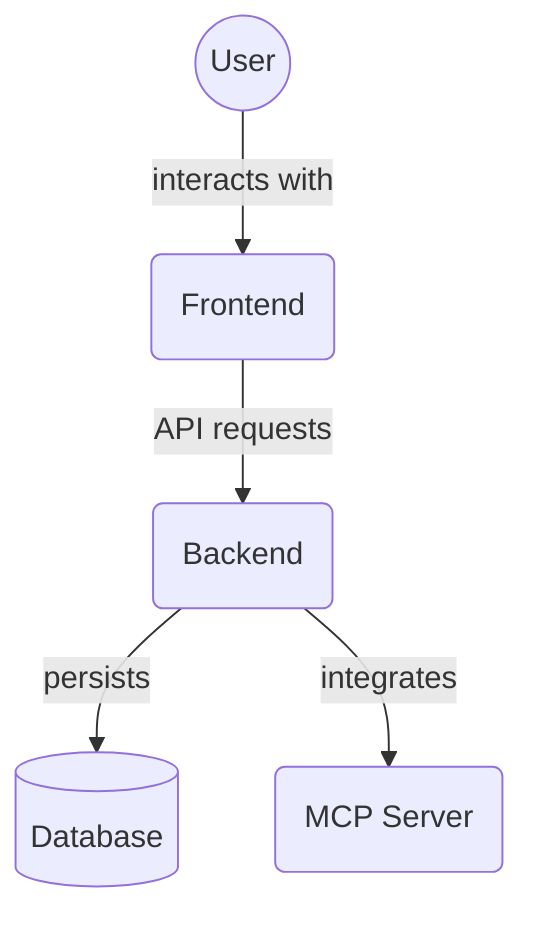

# Alembic Database Migrations (`backend/alembic/`)

This directory contains the configuration and scripts for Alembic, a database migration tool for SQLAlchemy. Alembic allows for the management of relational database schemas in a version-controlled and incremental way.

## Purpose of Alembic

When your SQLAlchemy models (defined in `backend/models.py`) change, Alembic can compare the models against the current state of your database schema and automatically generate migration scripts. These scripts contain Python code to apply the necessary changes (e.g., create tables, add columns, modify types) to bring the database schema in line with the models.

This is crucial for:
-   **Schema Versioning**: Keeping track of database changes alongside your application code.
-   **Reproducibility**: Ensuring that database schemas can be consistently created and upgraded across different environments (development, testing, production).
-   **Collaboration**: Allowing multiple developers to make and track schema changes without conflicts.
-   **Memory Service Support**: Includes schema management for Memory/Knowledge Graph models alongside core Project Management entities.

## Directory Contents Overview

This directory contains the configuration and migration scripts for Alembic, used to manage database schema changes.

Key files and directories:

*   `versions/`: Contains the individual database migration script files.
*   `env.py`: Environment setup for Alembic, including database connection logic.
*   `script.py.mako`: Mako template file used by Alembic to generate new migration scripts.
*   `README`: A simple placeholder README.

## Key Files and Directories

-   **`

## Architecture Diagram

<!-- File List Start -->
## File List

- `README`
- `env.py`
- `script.py.mako`

<!-- File List End -->

