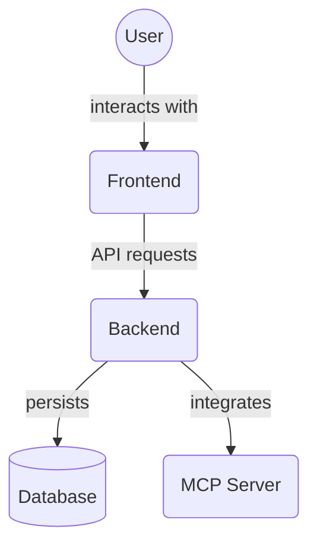

# Backend Configuration (`backend/config`)

This directory contains configuration modules for the FastAPI backend application. These modules handle application settings, router configuration, and logging setup.

Key files:

*   `app_config.py`: Contains the main application settings loaded from environment variables using Pydantic Settings.
*   `router_config.py`: Configures API routers and their dependencies.
*   `logging_config.py`: Sets up logging for the application.
*   `__init__.py`: Initializes the config package.

## Architecture Diagram

<!-- File List Start -->
## File List

- `__init__.py`
- `app_config.py`
- `logging_config.py`
- `router_config.py`

<!-- File List End -->

