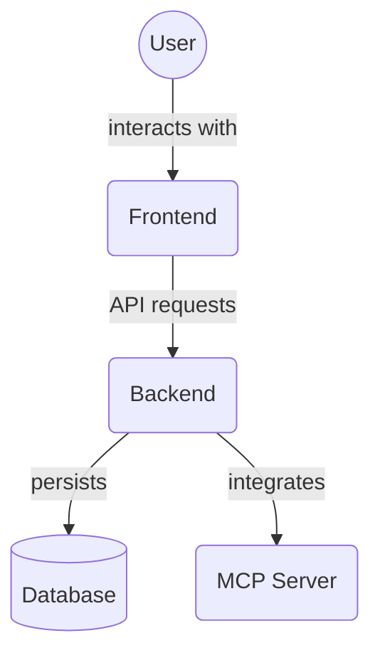

# Backend CRUD Utilities (`backend/crud/utils`)

This directory contains utility functions used within the CRUD operations in the `backend/crud/` directory. These functions provide reusable logic for common tasks like validation or data manipulation, helping to keep the main CRUD files cleaner.

Key files:

*   `user_utils.py`: Utility functions related to user data.
*   `task_file_utils.py`: Utility functions for task file associations.
*   `dependency_utils.py`: Utility functions for task dependencies.
*   `file_association_utils.py`: Utility functions for file associations (likely related to the Memory service).
*   `__init__.py`: Initializes the utils package.

## Architecture Diagram

<!-- File List Start -->
## File List

- `__init__.py`
- `dependency_utils.py`
- `file_association_utils.py`
- `task_file_utils.py`
- `user_utils.py`

<!-- File List End -->

