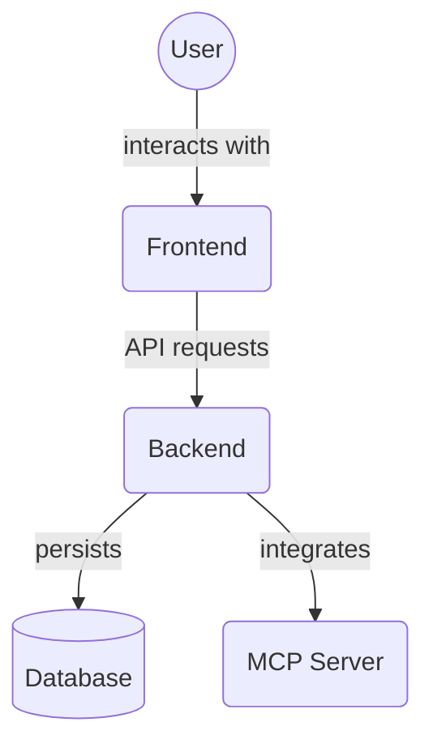

# Backend MCP Tools (`backend/mcp_tools`)

This directory contains utilities and interfaces specifically designed for integration with the Model Context Protocol (MCP) within the backend. These tools facilitate agent interaction with core backend functionalities like task and project management, and the Memory Service.

Key files:

*   `task_tools.py`: MCP-specific tools for interacting with tasks.
*   `memory_tools.py`: MCP-specific tools for interacting with the Memory Service.
*   `project_tools.py`: MCP-specific tools for interacting with projects.
*   `__init__.py`: Initializes the mcp_tools package.

## Architecture Diagram

<!-- File List Start -->
## File List

- `__init__.py`
- `memory_tools.py`
- `project_tools.py`
- `task_tools.py`
- `template_tools.py`

<!-- File List End -->

