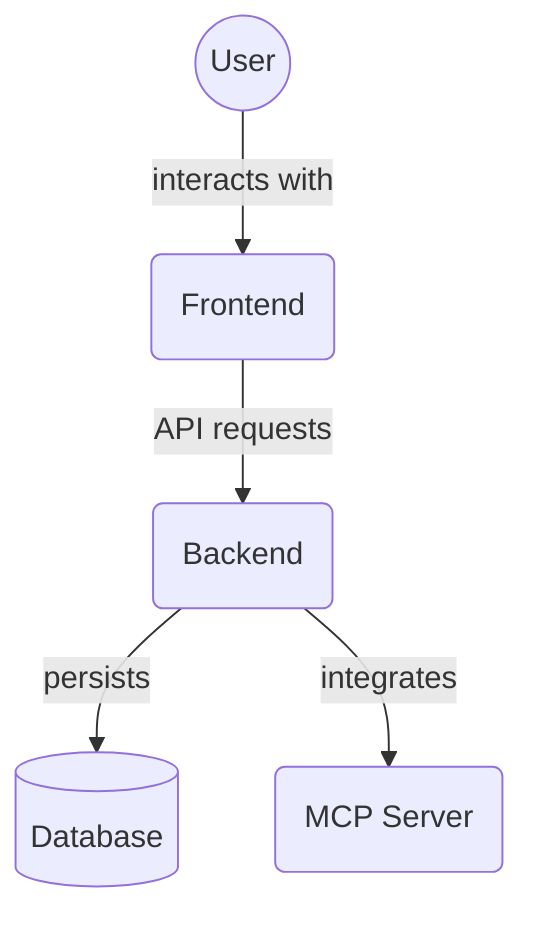

# Backend MCP Tools (`backend/mcp_tools`)

This directory contains utilities and interfaces specifically designed for integration with the Model Context Protocol (MCP) within the backend. These tools facilitate agent interaction with core backend functionalities like task and project management, and the Memory Service.

Key files:

*   `task_tools.py`: MCP-specific tools for interacting with tasks.
*   `memory_tools.py`: MCP-specific tools for interacting with the Memory Service.
*   `project_tools.py`: MCP-specific tools for interacting with projects.
*   `project_file_tools.py`: Associate memory files with projects.
*   `rule_tools.py`: Tools for managing agent rules and mandates.
*   `agent_handoff_tools.py`: Tools for managing agent handoff criteria.
*   `forbidden_action_tools.py`: Tools for creating and listing forbidden actions for agent roles.
*   `capability_tools.py`: Tools for managing agent capabilities.
*   `error_protocol_tools.py`: Tools for creating and listing error protocols for agent roles.
*   `user_role_tools.py`: Tools for assigning, listing, and removing user roles.
*   `__init__.py`: Initializes the mcp_tools package.

## Architecture Diagram


## Usage Examples

### Create a Forbidden Action

```python
from backend.mcp_tools.forbidden_action_tools import create_forbidden_action_tool

result = await create_forbidden_action_tool(
    agent_role_id="manager",
    action="deploy_production",
    reason="Only ops may deploy",
    db=session,
)
```

### List Forbidden Actions

```python
from backend.mcp_tools.forbidden_action_tools import list_forbidden_actions_tool

actions = await list_forbidden_actions_tool(agent_role_id="manager", db=session)
```

<!-- File List Start -->
## File List

- `__init__.py`
- `agent_handoff_tools.py`
- `capability_tools.py`
- `error_protocol_tools.py`
- `forbidden_action_tools.py`
- `memory_tools.py`
- `project_file_tools.py`
- `project_template_tools.py`
- `project_tools.py`
- `rule_tools.py`
- `task_tools.py`
- `user_role_tools.py`
- `verification_requirement_tools.py`

<!-- File List End -->


