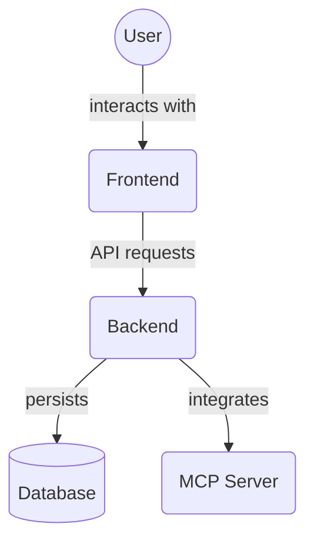

# Backend Middleware (`backend/middleware`)

This directory contains FastAPI middleware components and error handlers. Middleware functions are executed for every request, allowing for cross-cutting concerns like request processing and error handling before reaching the route handlers.

Key files:

*   `request_middleware.py`: Contains middleware for processing incoming requests.
*   `error_handlers.py`: Defines custom exception handlers for the application.
*   `__init__.py`: Initializes the middleware package.

## Architecture Diagram

<!-- File List Start -->
## File List

- `__init__.py`
- `error_handlers.py`
- `request_middleware.py`

<!-- File List End -->

