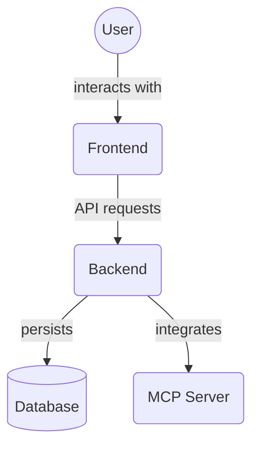

# SQLAlchemy Models (`backend/models`)

This directory contains the SQLAlchemy ORM models that define the structure of the database for the MCP Project Manager Suite.

Key models include:

*   `Project`: Represents a project.
*   `Task`: Represents a task within a project.
*   `Agent`: Represents an AI agent.
*   `User`: Represents a user.
*   `Memory`: Models for the Knowledge Graph/Memory service.
*   `TaskDependency`: Defines dependencies between tasks.
*   `TaskFileAssociation`: Links tasks to associated files/Memory entities.
*   `Comment`: Represents comments on tasks.
*   `AuditLog`: Records audit trails of actions.
*   `AgentHandoffCriteria`, `AgentVerificationRequirement`, `AgentForbiddenAction`, `AgentErrorProtocol`, `AgentCapability`, `AgentRole`: Models related to agent capabilities and protocols.
*   `UniversalMandate`: Represents system-wide mandates.
*   `Workflow`, `ProjectMember`, `ProjectTemplate`, `TaskStatus`, `TaskRelations`, `Core`, `Base`, `Types`: Other supporting models and base classes.

## Architecture Diagram

<!-- File List Start -->
## File List

- `__init__.py`
- `agent.py`
- `agent_capability.py`
- `agent_error_protocol.py`
- `agent_forbidden_action.py`
- `agent_handoff_criteria.py`
- `agent_role.py`
- `agent_verification_requirement.py`
- `audit.py`
- `base.py`
- `comment.py`
- `core.py`
- `memory.py`
- `project.py`
- `project_member.py`
- `project_template.py`
- `task.py`
- `task_dependency.py`
- `task_file_association.py`
- `task_relations.py`
- `task_status.py`
- `types.py`
- `universal_mandate.py`
- `user.py`
- `user_role.py`
- `workflow.py`

<!-- File List End -->

