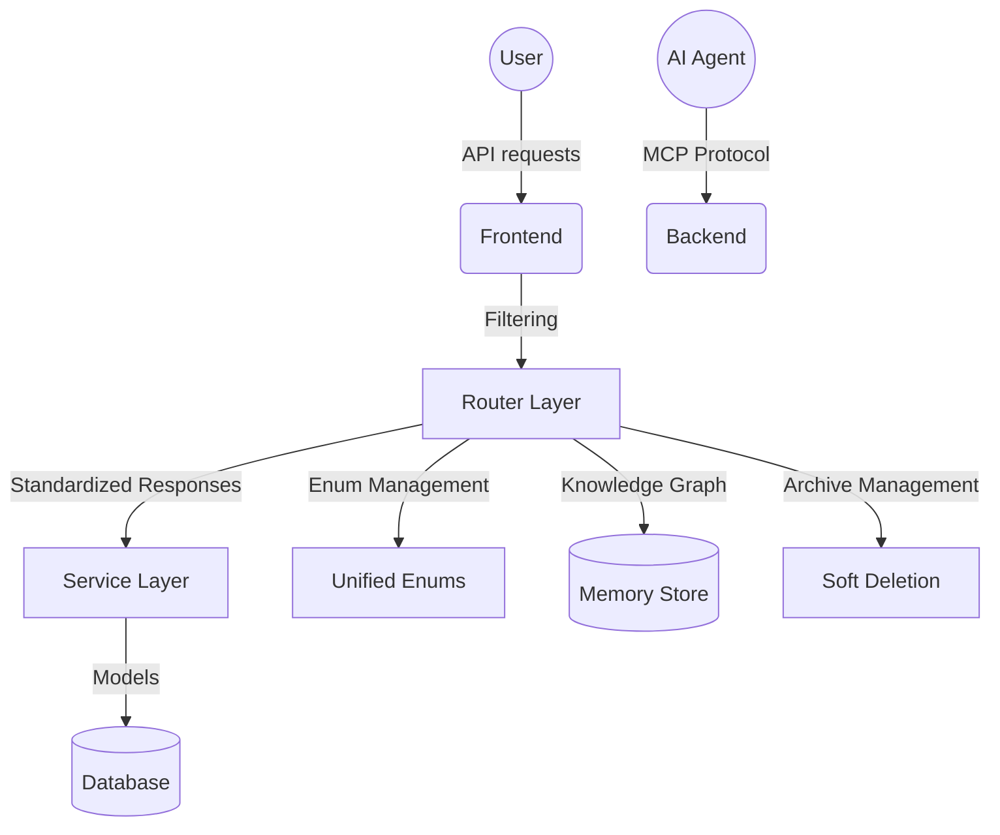

# API Routers (`backend/routers`)

This directory contains the FastAPI routers that define the **46 API endpoints** for the MCP Project Manager Suite backend. The endpoints are organized into modular files within subdirectories for better organization, maintainability, and feature consistency.

## 🎯 Router Architecture

### Core Entity Management

**`projects/`** - **Project Management**
- `core.py`: **Project CRUD** with filtering (status, priority, visibility, search, archived state, owner)
- `files.py`: Project-file associations with validation
- `members.py`: Role-based member management with permissions
- `planning.py`: Project planning and workflow features

**`tasks/`** - **Task Management**
- `core/core.py`: **Task operations** with filtering (agent, status, search, archived, sorting)
- `dependencies/dependencies.py`: Task dependency management with relationship types
- Task workflow with 18 distinct statuses

**`users/`** - **User Management**
- `core/core.py`: **Role-based user operations** with filtering (role, active status, search across multiple fields)
- `auth/`: Authentication and token generation with role validation

**`agents/`** - **Agent Management**  
- `core.py`: **Agent operations** with status filtering, archive/unarchive, and capability tracking

### New Features

**`enums.py`** - **Enum Value Endpoints**
- `/project-status` - Available project statuses (`active`, `completed`, `paused`, `archived`, `cancelled`)
- `/project-priority` - Available project priorities (`low`, `medium`, `high`, `critical`)  
- `/project-visibility` - Available visibility levels (`private`, `team`, `public`)
- `/project-member-role` - Available member roles
- `/task-status` - Available task statuses (18 workflow states)

**Response Models**
- All endpoints use `DataResponse[T]` for single items
- All listing endpoints use `ListResponse[T]` with pagination info
- Error handling and status codes

### Specialized Services

**`memory/`** - **Knowledge Graph & Storage**
- `core/`: Core memory entity operations with relationship mapping
- `observations/`: Memory observation endpoints with context tracking
- `relations/`: Memory relation endpoints with graph traversal

**`mcp/`** - **MCP Tool Integration**
- Core MCP tools and agent automation endpoints
- Metrics and monitoring capabilities with usage tracking
- Stream event subscription for real-time updates

**`audit_logs/`** - **Audit Management**
- Change tracking across all entities
- Archive/restore operation logging
- User action monitoring with detailed context

**`comments/`** - **Comment Management**
- Threaded comment system for projects and tasks
- User attribution and timestamp tracking

**`project_templates/`** - **Template Management**
- Project template CRUD operations
- Template-based project creation workflow

**`rules/`** - **Rules Framework**
- `logs/`: Agent behavior logs and tracking
- `mandates/`: Universal mandates and compliance
- `roles/`: Agent roles with capabilities
- `roles/capabilities/`: Agent capability management
- `roles/forbidden_actions/`: Action restriction management
- `templates/`: Prompt templates and automation
- `utils/`: Rule validation and prompt generation utilities
- `violations/`: Rule violation tracking and reporting
- `workflows/`: Workflow automation and management

## 🚀 API Summary

### ✅ Filtering Capabilities
- **Projects**: Filter by status, priority, visibility, owner, archived state + search by name/description
- **Tasks**: Filter by agent, status, search terms, archived state with sorting
- **Users**: Filter by role, active status + search across username/email/full_name  
- **Agents**: Filter by status, capabilities, archived state + search

### ✅ Archive Management
Soft deletion with restore capabilities across all major entities:
- Projects: `POST /{id}/archive` & `POST /{id}/unarchive`
- Tasks: `POST /{task_number}/archive` & `POST /{task_number}/unarchive`
- Agents: `POST /{id}/archive` & `POST /{id}/unarchive`

### ✅ Unified Enum System
- Centralized enum definitions in `/backend/enums.py`
- Frontend-accessible via `/api/v1/enums/` endpoints
- Validation across all entity operations

### ✅ Pagination
- Total count support for UI rendering
- Pagination parameters across all listing endpoints
- `has_more` flags for infinite scroll implementations

## 📊 Endpoint Categories & Count

| Category | Endpoints | Key Features |
|----------|-----------|-------------|
| **Projects** | 8 | Filtering, archive/unarchive, member management |
| **Tasks** | 12 | Workflow, dependency management, agent assignment |
| **Users** | 6 | Role-based filtering, authentication, profile management |
| **Agents** | 8 | Status management, capability tracking, archive functionality |
| **Enums** | 5 | Frontend dropdown population, validation support |
| **Memory** | 4 | Knowledge graph, file ingestion, relationship mapping |
| **MCP Tools** | 3+ | Agent automation, metrics, real-time events |

**Total: 46+ API Routes**

## 🧠 Architecture Diagram

## 🔧 Key Features

### **Consistency**
- Standardized response models across all endpoints
- Unified error handling and status codes
- Naming conventions and URL patterns

### **Filtering & Search**  
- Filtering capabilities on all major entities
- Full-text search across relevant fields
- Pagination with total counts

### **Status Management**
- Enum system for all entity states
- Archive/restore functionality with audit trails
- Workflow status transitions with validation

### **Developer Experience**
- Auto-generated OpenAPI documentation at `/docs`
- Interactive API explorer at `/redoc`
- Type safety with Pydantic schemas

Interactive API documentation is available at `/docs` and `/redoc` when the backend server is running.

---

This router architecture provides a foundation for the MCP Project Manager Suite with CRUD operations, filtering, and data management patterns across all entities.

## Router Subdirectories:

*   `agents/`: Contains endpoints related to AI agents.
*   `audit_logs/`: Contains endpoints for managing audit log entries.
*   `comments/`: Contains endpoints for managing comments.
*   `mcp/`: Contains endpoints for MCP (Multi-Agent Computation Platform) core tools and integrations.
*   `memory/`: Contains endpoints for the Memory Service / Knowledge Graph, including core entity operations, observations, and relations.
    *   `core/`: Core memory entity operations.
    *   `observations/`: Memory observation endpoints.
    *   `relations/`: Memory relation endpoints.
*   `project_templates/`: Contains endpoints for managing project templates.
*   `projects/`: Contains endpoints for project management.
    *   `core/`: Core project operations (create, retrieve, update, delete, list, archive, unarchive).
    *   `files/`: Endpoints for associating files with projects.
    *   `members/`: Endpoints for managing project members.
    *   `planning/`: Endpoints related to project planning (e.g., generating planning prompts).
*   `rules/`: Contains endpoints for the Rules Framework.
    *   `logs/`: Agent behavior logs.
    *   `mandates/`: Universal mandates.
    *   `roles/`: Agent roles.
    *   `roles/capabilities/`: Agent capabilities.
    *   `roles/forbidden_actions/`: Agent forbidden actions.
    *   `templates/`: Prompt templates.
    *   `utils/`: Utility endpoints (e.g., rule validation, prompt generation).
    *   `violations/`: Rule violations.
    *   `workflows/`: Workflows.
*   `tasks/`: Contains endpoints for task management.
    *   `all_tasks/`: System-wide task listing.
    *   `comments/`: Task comments.
    *   `core/`: Core task operations.
    *   `dependencies/`: Task dependencies.
    *   `files/`: Task file associations.
*   `users/`: Contains endpoints for user management.
    *   `auth/`: Authentication and token generation.
    *   `core/`: Core user management operations.

<!-- File List Start -->
## File List

- `