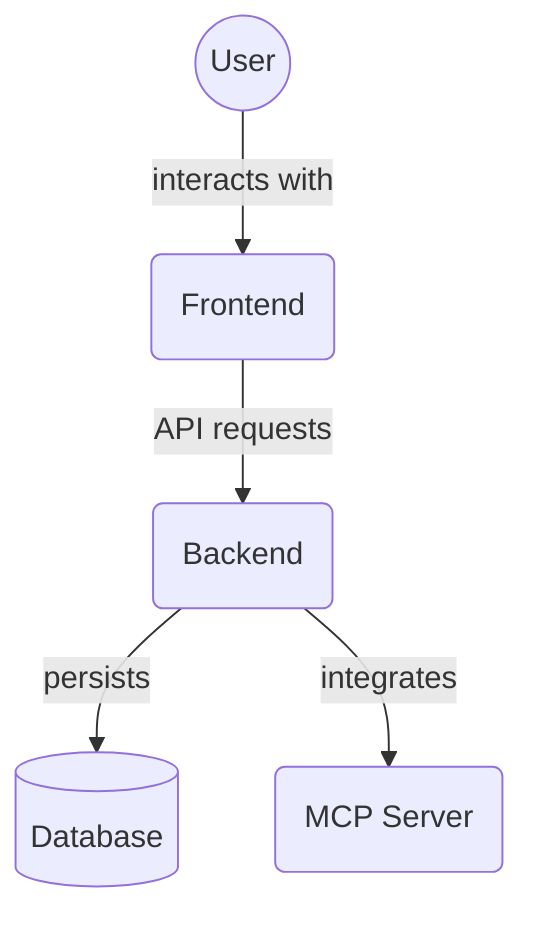

# Backend Services (`backend/services`)

This directory contains the business logic and service layer for the MCP Project Manager Suite backend. Services interact with the database (via CRUD functions) and handle complex operations and validations.

Key service files include:

*   `task_service.py`: Contains logic for managing tasks, including creation, retrieval, updates, deletion, archiving, unarchiving, and handling task dependencies and file associations.
*   `project_service.py`: Contains logic for managing projects.
*   `agent_service.py`: Contains logic for managing AI agents.
*   `user_service.py`: Contains logic for managing users.
*   `memory_service.py`: Contains logic for the Memory Service/Knowledge Graph, including managing memory entities and relationships, and task file associations.
*   `task_dependency_service.py`: Contains specific logic for creating, retrieving, and managing task dependencies.
*   `task_file_association_service.py`: Contains specific logic for creating, retrieving, and managing associations between tasks and files/Memory entities.
*   `rules_service.py`: Contains logic related to managing and applying agent rules.
*   `audit_log_service.py`: Contains logic for recording and retrieving audit logs.
*   `comment_service.py`: Contains logic for managing comments on tasks.
*   `project_member_service.py`: Contains logic for managing project memberships.
*   `project_template_service.py`: Contains logic for managing project templates.
*   `project_file_association_service.py`: Contains logic for managing associations between projects and files/Memory entities.
*   `exceptions.py`: Defines custom exceptions used within the services.
*   `utils.py`: Contains utility functions used across services.

## Architecture Diagram

<!-- File List Start -->
## File List

- `__init__.py`
- `agent_capability_service.py`
- `agent_error_protocol_service.py`
- `agent_forbidden_action_service.py`
- `agent_handoff_service.py`
- `agent_service.py`
- `audit_log_service.py`
- `comment_service.py`
- `error_protocol_service.py`
- `exceptions.py`
- `memory_service.py`
- `project_file_association_service.py`
- `project_member_service.py`
- `project_service.py`
- `project_template_service.py`
- `rules_service.py`
- `task_dependency_service.py`
- `task_file_association_service.py`
- `task_service.py`
- `user_role_service.py`
- `user_service.py`
- `utils.py`

<!-- File List End -->

