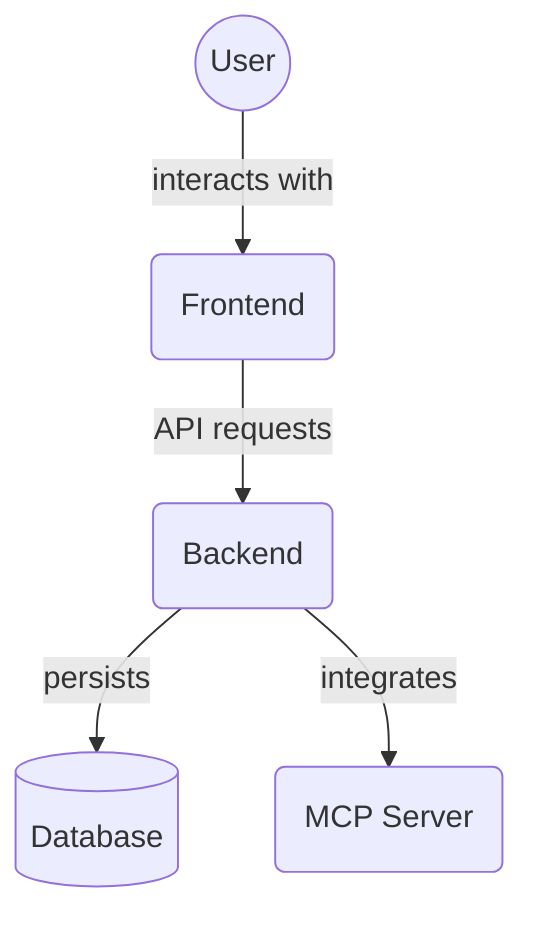

# Task Manager Backend Testing Guide

## Test Structure

### Directories
- `unit/`: Unit tests for individual components
- `integration/`: Integration and API tests
- `conftest.py`: Shared test fixtures and configurations

## Running Tests

### Prerequisites
- Ensure you're in the project's virtual environment
- Install test dependencies:
  ```
  pip install -r requirements.txt
  pip install pytest pytest-cov pytest-mock pytest-asyncio httpx faker
  ```

### Test Execution
- Run all tests:
  ```
  pytest
  ```
- Run with coverage report:
  ```
  pytest --cov=. --cov-report=html
  ```
- Run specific test file:
  ```
  pytest tests/test_tasks_crud.py
  ```

## Test Writing Guidelines
1. Use meaningful test function names
2. Test both successful and failure scenarios
3. Use fixtures for setup and teardown
4. Mock external dependencies
5. Aim for high code coverage

## Debugging
- Use `-s` flag to see print statements
- Use `-v` for verbose output

## Continuous Integration
Tests are automatically run on push and pull requests via GitHub Actions.

## Architecture Diagram


<!-- File List Start -->
## File List

- `__init__.py`
- `conftest.py`
- `conftest_backup.py`
- `test_crud.py`
- `test_integration.py`
- `test_memory_endpoints.py`
- `test_memory_ingestion.py`
- `test_memory_service.py`
- `test_openapi.py`
- `test_project_file_service.py`
- `test_project_member_service.py`
- `test_project_task_endpoints.py`
- `test_prompt_templates.py`
- `test_rules_service.py`
- `test_simple.py`

<!-- File List End -->


