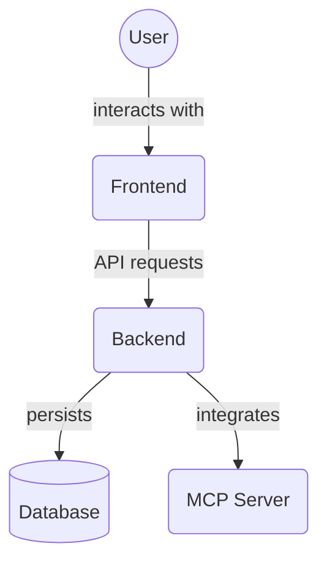

# Backend Integration Tests (`backend/tests/integration`)

This directory contains integration tests for the backend application. Integration tests verify the interaction between multiple components or services to ensure they work together correctly.

Key files:

*   `test_project_task_flow.py`: Tests the integrated flow of project and task management operations.

## Architecture Diagram

<!-- File List Start -->
## File List

- `test_project_task_flow.py`

<!-- File List End -->

