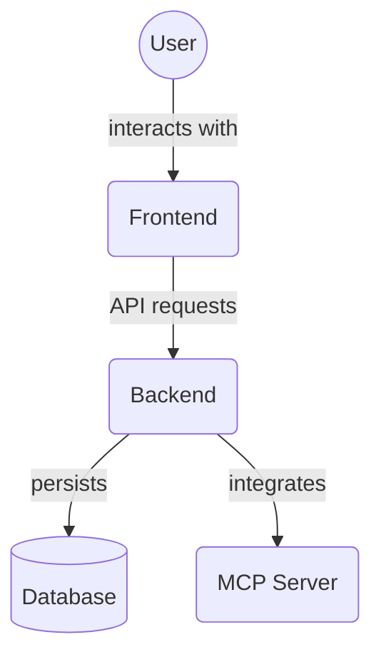

# Backend Unit Tests (`backend/tests/unit`)

This directory contains unit tests for specific modules within the backend application. Unit tests focus on testing individual functions, classes, or components in isolation.

Subdirectories contain unit tests for different backend layers:

*   `crud/`: Unit tests for database CRUD functions.
*   `database/`: Unit tests for database connection and setup.
*   `routes/`: Unit tests for API router endpoint logic.
*   `services/`: Unit tests for business logic services.

## Architecture Diagram

<!-- File List Start -->
## File List

<!-- File List End -->

