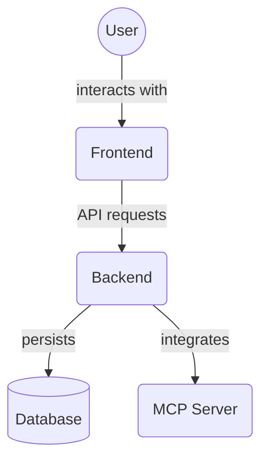

# Backend Unit Tests - CRUD (`backend/tests/unit/crud`)

This directory contains unit tests specifically for the database CRUD functions located in `backend/crud/`. These tests ensure that the individual CRUD operations (Create, Read, Update, Delete) work correctly in isolation from other parts of the application.

Key files:

*   `test_projects.py`: Unit tests for project CRUD functions.

## Architecture Diagram

<!-- File List Start -->
## File List

<!-- File List End -->

