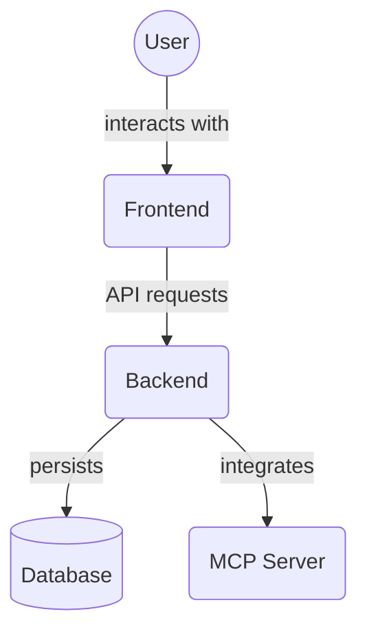

# Backend Unit Tests - Database (`backend/tests/unit/database`)

This directory is intended to contain unit tests for the database connection and session management logic defined in `backend/database.py`. These tests would verify the correct setup and teardown of database connections and sessions in a controlled environment.

*Note: This directory is currently empty, indicating that database unit tests have not yet been implemented.*

## Architecture Diagram

<!-- File List Start -->
## File List

<!-- File List End -->

