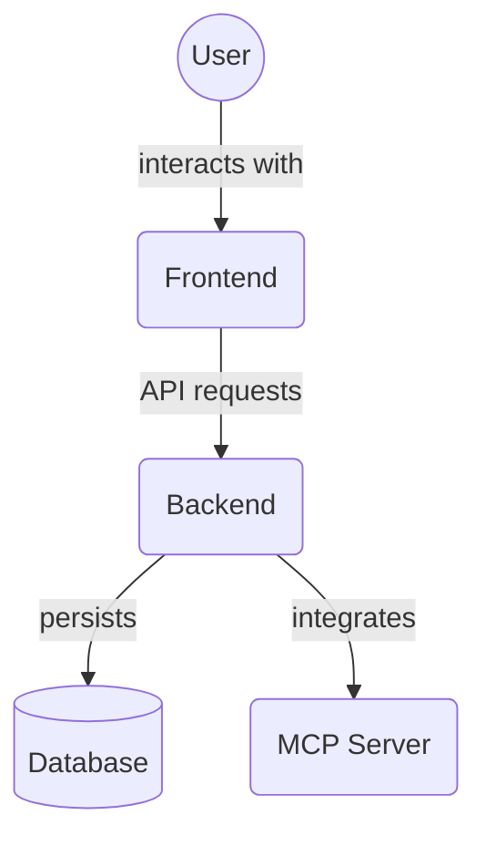

# Backend Unit Tests - Routes (`backend/tests/unit/routes`)

This directory contains unit tests for the API router endpoint logic in the backend application. These tests verify that the route handlers (defined in `backend/routers/`) behave as expected, including correct request handling, response formatting, and error management.

Key files:

*   `test_project_routes.py`: Unit tests for project-related API routes.

## Architecture Diagram

<!-- File List Start -->
## File List

<!-- File List End -->

