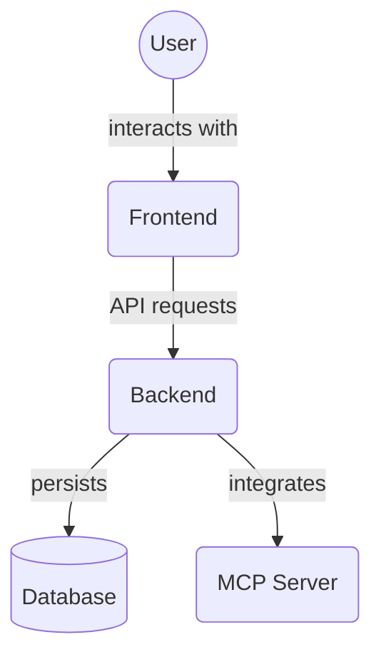

# Backend Unit Tests - Services (`backend/tests/unit/services`)

This directory contains unit tests for the business logic service layer in the backend application. These tests verify that the service functions (defined in `backend/services/`) perform the correct operations, handle edge cases, and interact properly with other backend components.

Key files:

*   `test_project_service.py`: Unit tests for project-related service logic.

## Architecture Diagram

<!-- File List Start -->
## File List

<!-- File List End -->

