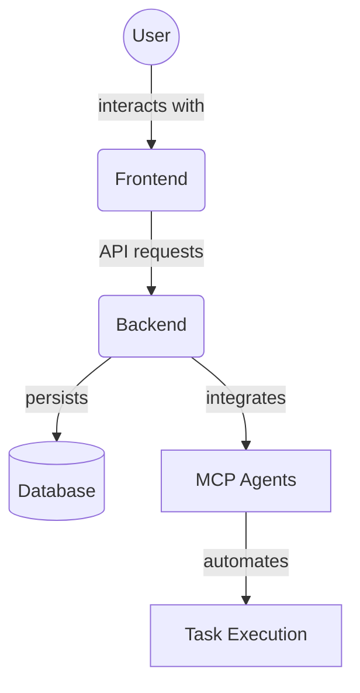

# 📋 Project Overview

## What is MCP Project Manager?

The **MCP Project Manager Suite** is an open-source, full-stack collaborative project management platform that empowers both human users and AI agents to manage, automate, and execute complex projects end-to-end.

## 🎯 Mission Statement

To provide a mission-critical, enterprise-grade task and project management platform with the reliability and precision required for complex operations, featuring seamless human-AI collaboration through the Model Context Protocol (MCP).

## 🌟 Key Highlights

- **Full-Stack Solution**: Complete FastAPI backend + Next.js frontend
- **AI-Powered**: Integrated AI agents via Model Context Protocol (MCP)
- **Enterprise-Ready**: Built with aerospace-grade reliability standards
- **Open Source**: ISC licensed for community collaboration
- **Production-Ready**: Comprehensive testing and monitoring

## 🏗️ System Architecture

### Core Components

1. **Backend Services** - FastAPI-based microservices architecture
2. **Frontend Application** - Next.js React application with TypeScript
3. **Database Layer** - SQLite with SQLAlchemy ORM
4. **Agent System** - MCP-powered AI agents for automation
5. **Integration Layer** - RESTful APIs with standardized responses

## 🎯 Target Users

### Development Teams
- **Project Managers** - Comprehensive project oversight and planning
- **Developers** - Task management and code integration
- **QA Engineers** - Testing workflow automation
- **DevOps** - Deployment and monitoring automation

### Enterprise Organizations
- **IT Departments** - Internal project management
- **Consulting Firms** - Client project tracking
- **Startups** - Agile development workflows
- **Research Teams** - Complex project coordination

## 🚀 Value Proposition

### For Human Users
- **Intuitive Interface** - Clean, modern UI with dark/light themes
- **Comprehensive Features** - Complete project lifecycle management
- **Real-time Updates** - Live status tracking and notifications
- **Flexible Workflows** - Customizable to team needs

### For AI Integration
- **Agent Automation** - AI agents handle routine tasks
- **Smart Scheduling** - Intelligent task prioritization
- **Automated Reporting** - AI-generated status reports
- **Predictive Analytics** - Project timeline predictions

### For Organizations
- **Cost Effective** - Open source with no licensing fees
- **Scalable** - Grows with your organization
- **Secure** - Enterprise-grade security features
- **Compliant** - Audit trails and compliance reporting

## 📊 Success Metrics

### Quality Standards
- **Code Coverage**: 100% target
- **API Coverage**: 100% achieved
- **Uptime**: 99.9% requirement
- **Response Time**: <200ms (95th percentile)

### Compliance
- **NASA Software Engineering Requirements (NPR 7150.2)**
- **ISO 9001:2015 Quality Management**
- **NIST Cybersecurity Framework**

## 🔄 Development Philosophy

### Core Principles
1. **Data Model as Source of Truth** - Database models drive everything
2. **Fail-Safe Design** - Graceful degradation under load
3. **Security by Design** - Built-in security at every layer
4. **Scalability First** - Horizontal scaling capabilities
5. **Community Driven** - Open source collaboration

### Quality Assurance
- **Automated Testing** - Comprehensive test suites
- **Code Standards** - Strict linting and formatting
- **Documentation** - Aerospace-grade documentation
- **Continuous Integration** - Automated quality checks

## 🌐 Ecosystem Integration

### Development Tools
- **GitHub Actions** - CI/CD pipelines
- **Docker** - Containerization support
- **Prometheus/Grafana** - Monitoring and metrics
- **Pre-commit Hooks** - Code quality enforcement

### AI/ML Integration
- **Model Context Protocol** - Standardized AI agent communication
- **Custom Agents** - Extensible agent framework
- **Knowledge Graph** - Intelligent data relationships
- **Memory Service** - Persistent AI context

## 📈 Roadmap Highlights

### Current (v2.0)
- ✅ Complete CRUD operations
- ✅ AI agent integration
- ✅ Real-time updates
- ✅ Comprehensive testing

### Near Term (v2.1)
- 🔄 Enhanced monitoring
- 🔄 Performance optimization
- 🔄 Advanced agent capabilities
- 🔄 Mobile responsiveness

### Future (v3.0)
- 📋 Multi-tenant support
- 📋 Advanced analytics
- 📋 Plugin ecosystem
- 📋 Cloud deployment options

---

## Next Steps

- **[Architecture Details](./architecture.md)** - Deep dive into system design
- **[Tech Stack](./tech-stack.md)** - Technologies and frameworks used
- **[Features](./features.md)** - Complete feature breakdown
- **[Quick Start](../02-setup/quick-start.md)** - Get started in 5 minutes 