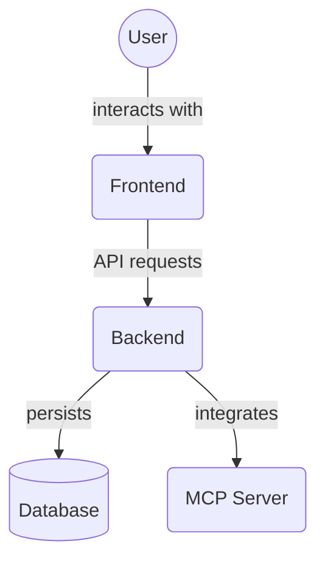

This is a [Next.js](https://nextjs.org) project bootstrapped with [`create-next-app`](https://nextjs.org/docs/app/api-reference/cli/create-next-app).

## Getting Started

### Environment Setup

Ensure you have **Node.js 18 or later** installed. We recommend using [nvm](https://github.com/nvm-sh/nvm) or a similar version manager to manage Node versions.

Copy the example environment file and adjust the API URL if needed:

```bash
cp .env.local.example .env.local
```

`NEXT_PUBLIC_API_BASE_URL` points to your backend server and defaults to `http://localhost:8000`.

First, run the development server:

```bash
npm run dev
# or
yarn dev
# or
pnpm dev
# or
bun dev
```

Open [http://localhost:3000](http://localhost:3000) with your browser to see the result.

You can start editing the page by modifying `app/page.tsx`. The page auto-updates as you edit the file.

This project uses [`next/font`](https://nextjs.org/docs/app/building-your-application/optimizing/fonts) to automatically optimize and load [Geist](https://vercel.com/font), a new font family for Vercel.

## Learn More

To learn more about Next.js, take a look at the following resources:

- [Next.js Documentation](https://nextjs.org/docs) - learn about Next.js features and API.
- [Learn Next.js](https://nextjs.org/learn) - an interactive Next.js tutorial.

You can check out [the Next.js GitHub repository](https://github.com/vercel/next.js) - your feedback and contributions are welcome!

## Deploy on Vercel

The easiest way to deploy your Next.js app is to use the [Vercel Platform](https://vercel.com/new?utm_medium=default-template&filter=next.js&utm_source=create-next-app&utm_campaign=create-next-app-readme) from the creators of Next.js.

Check out our [Next.js deployment documentation](https://nextjs.org/docs/app/building-your-application/deploying) for more details.

## Key Features and UI Components

This frontend application provides a modern and responsive user interface for managing projects and tasks, built with Next.js, TypeScript, and Chakra UI. Key implemented features and their corresponding UI components include:

*   **Comprehensive Task Management:** Create, view, update, delete, archive, and unarchive tasks directly through the UI. The `ProjectDetail` page (`src/app/projects/[projectId]/page.tsx`) serves as the main hub for managing tasks within a project, utilizing components like `TaskItem` (`src/components/task/TaskItem.tsx`).
*   **Task Dependencies:** Visualize and manage task dependencies directly within the task details or project view.
*   **Task File Associations:** View and manage files linked to specific tasks, leveraging the backend Memory service.
*   **Responsive Design:** The UI is built with Chakra UI, providing a responsive layout that adapts to different screen sizes.
*   **Themeability:** Supports light and dark modes.

---

## Inception Project: Refactoring Status

This section tracks the progress of the "Inception Project," a comprehensive refactoring initiative aimed at improving modularity and maintainability of the frontend codebase.

### Overall Status: Partially Complete

While significant progress has been made, particularly with the `TaskItem` component, several other key components still require refactoring to meet the project's modularity goals (typically aiming for components under ~240 lines of code).

### Key Component Status:

*   **`TaskItem` (and sub-components in `src/components/task/`):**
    *   **Status:** Refactoring Complete.
    *   **Notes:** Successfully modularized, types/styles/utils extracted, and documented in `src/components/task/README.md`. Static analysis (lint, type-check, build) PASSES.
*   **`ProjectList.tsx` (`src/components/ProjectList.tsx`):**
    *   **Status:** Refactoring Incomplete.
    *   **Notes:** Currently 1107 lines. Still requires significant modularization. (Original Target: Dream Level 2)
*   **`Dashboard.tsx` (`src/components/Dashboard.tsx`):**
    *   **Status:** Refactoring Incomplete.
    *   **Notes:** Currently 587 lines. Still requires significant modularization. (Original Target: Dream Level 4)
*   **`TaskList.tsx` (`src/components/TaskList.tsx`):**
    *   **Status:** Refactoring Incomplete.
    *   **Notes:** Currently 296 lines. Still requires modularization. (Original Target: Dream Level 3)
*   **`TaskControls.tsx` (`src/components/TaskControls.tsx`):**
    *   **Status:** Refactoring Incomplete.
    *   **Notes:** Currently 337 lines. Still requires modularization. (Original Target: Dream Level 7)
*   **`MCPDevTools.tsx` (`src/components/MCPDevTools.tsx`):**
    *   **Status:** Refactoring Incomplete.
    *   **Notes:** Currently 452 lines. Still requires modularization. (Original Target: Dream Level 6)
*   Other components like `AgentList.tsx` and `SettingsContent.tsx` also remain relatively large and could be candidates for future refactoring.

### Verification Status:

*   **Static Analysis (Lint, Type Check, Build):** PASSING (after recent fixes).
*   **Automated Tests:** Currently, no "test" script is configured in `package.json` for the frontend. Adding comprehensive unit and integration tests is highly recommended.
*   **Browser-Based Audits (Accessibility, Performance, etc.):** Currently unavailable due to issues with the browser connector server. Restoring this capability is important for ongoing UI quality assurance.

### Recommendations:

1.  **Prioritize completion of refactoring for `ProjectList.tsx`, `Dashboard.tsx`, `TaskList.tsx`, `TaskControls.tsx`, and `MCPDevTools.tsx`.**
2.  **Implement a robust testing suite** for the frontend, including unit and integration tests.
3.  **Resolve browser connector issues** to enable comprehensive UI audits.
4.  Consider refactoring other larger components like `AgentList.tsx` and `SettingsContent.tsx`.

## Directory Contents Overview

This directory contains the Next.js frontend application for the MCP Project Manager Suite. It provides the user interface for interacting with the backend API.

Key files and directories:

*   `public/`: Static assets like images, favicons, and other public files.
*   `src/`: Contains the main application source code (pages, components, services, etc.).
*   `README.md`: This file, providing an overview of the frontend application and refactoring status.
*   `package.json`: Node.js package file managing dependencies and scripts.
*   `package-lock.json`: Records the exact versions of dependencies.
*   `next.config.ts`: Next.js configuration file.
*   `tsconfig.json`: TypeScript configuration file.
*   `postcss.config.mjs`: PostCSS configuration file.
*   `tailwind.config.ts`: Tailwind CSS configuration file.
*   `tests-e2e/`: End-to-end tests using Playwright.
*   `vitest.config.*`: Configuration files for Vitest unit/integration tests.

## Architecture Diagram


<!-- File List Start -->
## File List

- `.gitignore`
- `ARCHITECTURE.md`
- `BRAND_ASSETS_GUIDE.md`
- `COMPONENT_AUDIT_AND_REFACTOR_PLAN.md`
- `DESIGN_TOKENS.md`
- `TESTING_FRAMEWORK.md`
- `TESTING_FRAMEWORK_COMPLETE.md`
- `UI_UX_DESIGN_SYSTEM_SPECIFICATION.md`
- `dev_start.js`
- `eslint.config.cjs`
- `generate-comprehensive-tests.cjs`
- `generate-tests.js`
- `next.config.ts`
- `package-lock.json`
- `package.json`
- `playwright.config.ts`
- `postcss.config.mjs`
- `tailwind.config.ts`
- `test-runner.js`
- `tsconfig.json`
- `validate-testing-framework.js`
- `vitest.config.js`
- `vitest.config.ts`

<!-- File List End -->
