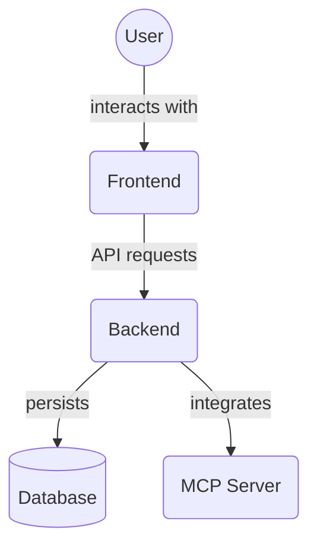

# Frontend Public Assets (`frontend/public/assets`)

This directory serves as a container for various static assets used by the frontend application, such as images, fonts, or other media files. These assets are served directly by the web server.

Key subdirectories:

*   `images/`: Contains image files used throughout the application.

## Architecture Diagram

<!-- File List Start -->
## File List

<!-- File List End -->

