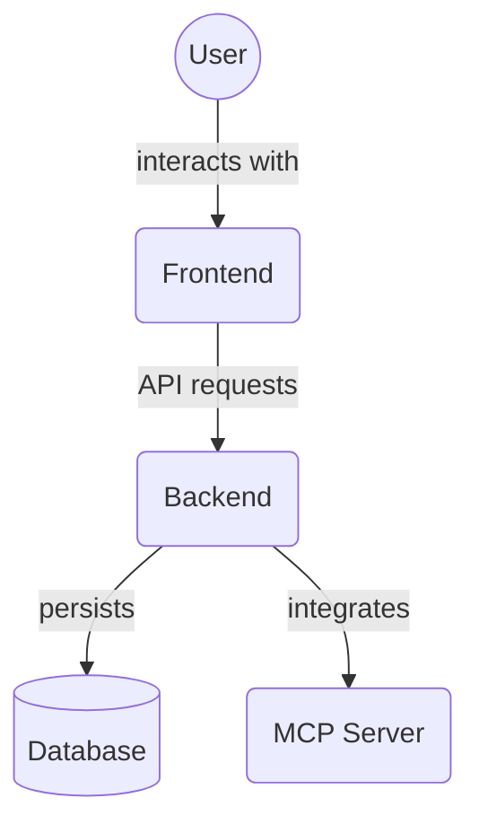

# Frontend Public Images (`frontend/public/assets/images`)

This directory contains image files used by the frontend application. These images are static assets served directly to the user's browser.

Key image files:

*   `logo_light.png`, `logo_dark.png`: Logo images for light and dark themes.
*   `icon_light.png`, `icon_dark.png`: Icon images for light and dark themes.

## Architecture Diagram

<!-- File List Start -->
## File List

- `icon_dark.png`
- `icon_light.png`
- `logo_dark.png`
- `logo_light.png`

<!-- File List End -->

