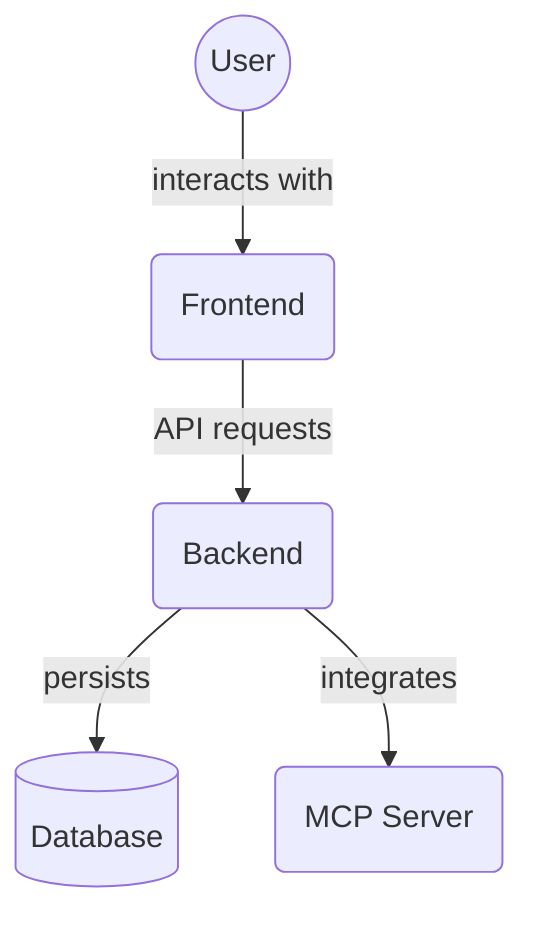

# Frontend Source (`frontend/src/`)

This directory contains the primary source code for the frontend application.

## Key Files

- `react-18-shims.d.ts`: This TypeScript definition file ensures compatibility with React 18. It extends the base React type definitions, particularly for HTML element types, by declaring a `ReactHTML` interface within the `'react'` module. It also includes some legacy validation map types (`ValidationMap`, `WeakValidationMap`) and a simplified `Validator` type.

- `theme.ts`: Defines the visual theme for the application using Chakra UI. It exports a `theme` object configured with:
  - **Colors**: A base color palette (`colors`) including `brand` colors (primary, secondary, accent) and various shades for `blue` and `gray`.
  - **Semantic Tokens**: `semanticTokens` are used to map abstract theme concepts (e.g., `bg.default`, `text.primary`) to specific color values for both light and dark modes. This allows for consistent theming across different color modes.
  - **Configuration**: Basic theme configuration (`config`) such as `initialColorMode` (set to 'system') and `useSystemColorMode` (set to `true`).
  - The theme is created using `extendTheme` from `@chakra-ui/react`.

## 🎨 Theming System & Design Tokens

This project uses a modern, dual-layered theming system built on **Chakra UI** and **Tailwind CSS**, powered by a comprehensive design token strategy. All visual styles—colors, spacing, typography, radii, etc.—are defined as tokens and consumed via CSS custom properties and Chakra's theme configuration.

### 🧩 Key Concepts

- **Design Tokens:**
  - Defined in `frontend/src/tokens/` (TypeScript) and imported directly into components and theme files. All tokens are TypeScript constants; no CSS variables or tokens.css are used.
  - Two layers:
    - **Core/Primitive Tokens:** Raw values (e.g., color hex codes, spacing units).
    - **Semantic Tokens:** Contextual names (e.g., `--colors-brandPrimary`, `--spacing-md`) mapped to primitives.
- **Chakra UI Theme:**
  - See `frontend/src/theme/chakra-theme.ts`.
  - Uses `extendTheme` to map tokens to Chakra's theme scale (colors, space, fontSizes, etc.).
  - Supports **light/dark mode** via semantic tokens and color mode config.
- **Tailwind CSS:**
  - Utility classes are available for rapid prototyping and layout.
  - Custom properties and tokens are referenced in global styles and can be used in custom CSS modules.

### 🌗 Light/Dark Mode Strategy

- Theme switching is managed by a `ThemeProvider` (see `frontend/src/contexts/ThemeContext.tsx`).
- The current theme is stored in `localStorage` and/or respects the user's OS preference.
- Theme switching is handled by `ThemeContext.tsx` and Chakra's color mode system, using TypeScript tokens for all values.
- All components adapt automatically to the current theme by consuming tokens.

### 🚀 Migration from Legacy CSS Variables

- **Old pattern:** Direct use of legacy CSS variables (e.g., `var(--core-colors-blue-500)`) or hardcoded values.
- **New pattern:** Import from `@tokens` (TypeScript) and use the exported constants in your components and theme files. Do not use CSS variables or tokens.css. All tokens are now managed in TypeScript.
- **Refactor status:**
  - See `COMPONENT_AUDIT_AND_REFACTOR_PLAN.md` for a detailed audit and migration log.
  - High-priority files and components are being refactored to use the new system.

### 🛠️ Best Practices

- **Always use tokens** for all design values (colors, spacing, typography, etc.).
- **Prefer Chakra UI props** for component styling; use CSS Modules only for structural/layout styles not covered by Chakra.
- **No hardcoded values** in TSX/JS or inline styles.
- **Document all new tokens** and update `DESIGN_TOKENS.md` as the system evolves.
- **Contribute to ongoing refactor:**
  - Reference the audit plan before editing components.
  - Follow naming conventions and update documentation as needed.

### 🧑‍💻 How to Contribute to Theming/UX

- Review `DESIGN_TOKENS.md` and `COMPONENT_AUDIT_AND_REFACTOR_PLAN.md` before making changes.
- Add or update tokens in `frontend/src/tokens/` and ensure they are mapped in `chakra-theme.ts`.
- Refactor components to use tokens and Chakra UI props.
- Update documentation and add inline comments where theming logic is non-obvious.
- If you find undocumented or inconsistent patterns, log them in the audit plan and propose improvements.

### ⚠️ Known Gaps & Ongoing Refactor

- Some components/pages may still use legacy tokens or hardcoded values.
- See the audit plan for current priorities and progress.
- If you encounter legacy patterns, refactor to the new system and document your changes.

---

For more details, see:

- `DESIGN_TOKENS.md` (token philosophy, structure, usage)
- `COMPONENT_AUDIT_AND_REFACTOR_PLAN.md` (migration log)
- `frontend/src/theme/chakra-theme.ts` (theme config)
- `frontend/src/contexts/ThemeContext.tsx` (theme switching logic)

## Directory Contents Overview

This directory (`frontend/src/`) contains the main source code for the frontend application, built with Next.js and TypeScript. It is organized into several subdirectories, each responsible for a specific aspect of the application's architecture.

Key files and directories:

*   `app/`: Contains Next.js App Router pages and core application layout.
*   `components/`: Reusable UI components.
*   `contexts/`: React Context providers for global state.
*   `lib/`: Utility functions and helper modules.
*   `providers/`: Wrappers for external libraries or services.
*   `services/`: API clients and frontend service logic.
*   `store/`: Frontend state management.
*   `theme/`: Application theme configuration.
*   `tokens/`: Design token definitions.
*   `types/`: TypeScript type definitions.
*   `utils/`: General utility functions.
*   `__tests__/`: Frontend test files.
*   `react-18-shims.d.ts`: TypeScript shims for React 18 compatibility.
*   `theme.ts`: Main theme file using Chakra UI.

## Subdirectories

The `src/` directory is further organized into the following subdirectories:

- `app/`: Likely contains application-specific pages or core routing logic (Next.js app router).
- `components/`: Houses reusable UI components used throughout the application.
- `contexts/`: Contains React context providers for managing global state or shared functionality.
- `lib/`: Utility functions, helper scripts, or third-party library configurations.
- `providers/`: Wrappers or providers for libraries or services (e.g., theme provider, query client provider).
- `services/`: Modules for interacting with APIs or backend services.
- `store/`: State management setup (e.g., Zustand, Redux, or other global state stores).
- `theme/`: May contain more granular theme customizations, overrides, or theme-related assets (although `theme.ts` is at the `src/` root).
- `types/`: TypeScript type definitions and interfaces used across the application.
- `__tests__/`: Contains test files, likely for unit or integration testing of the components and logic within the `src/` directory.

## Architecture Diagram

<!-- File List Start -->
## File List

<!-- File List End -->
