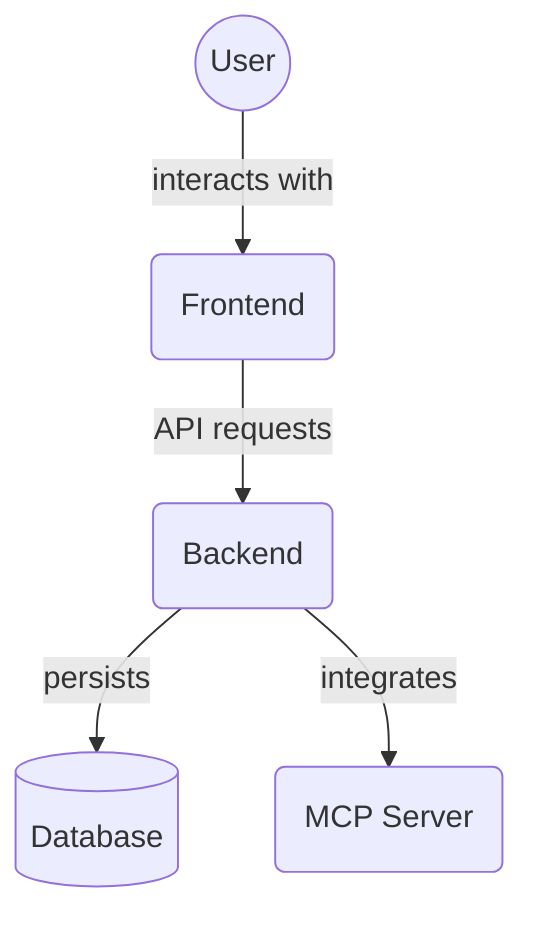

# Frontend Tests (`frontend/src/__tests__/`)

This directory contains the frontend test suite, primarily using Vitest. It includes various types of tests to ensure the quality and correctness of the frontend application.

Key files and directories:

*   `setup.ts`: Test setup file, configuring the testing environment (e.g., mocking browser APIs, setting up testing library).
*   `integration/`: Contains integration tests.
*   `factories/`: Test data factories for generating consistent test data.
*   `mocks/`: Mock implementations for dependencies (e.g., API services).
*   `utils/`: Test utility functions.
*   `.gitkeep`: Placeholder file to ensure the directory is included in Git.

## Architecture Diagram

<!-- File List Start -->
## File List

- `.gitkeep`
- `setup.ts`

<!-- File List End -->

