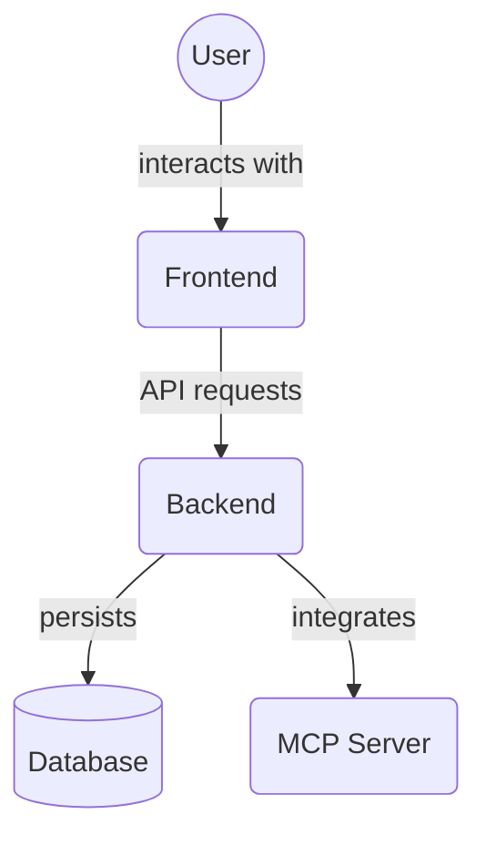

# Frontend Test Factories (`frontend/src/__tests__/factories/`)

This directory contains test data factories. These factories provide functions to easily generate realistic-looking data for various entities (e.g., tasks, projects, agents) for use in tests. This helps ensure test consistency and reduces boilerplate.

Key files:

*   `comprehensive.factory.ts`: A factory likely for generating a larger, interconnected set of data (e.g., projects with tasks).
*   `user.factory.ts`: Factory for generating user data.
*   `project.factory.ts`: Factory for generating project data.
*   `task.factory.ts`: Factory for generating task data.
*   `index.ts`: Barrel file re-exporting the factories.

## Architecture Diagram

<!-- File List Start -->
## File List

- `comprehensive.factory.ts`
- `index.ts`
- `project.factory.ts`
- `task.factory.ts`
- `user.factory.ts`

<!-- File List End -->

