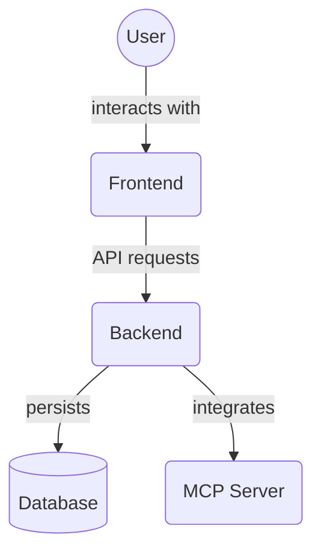

# Frontend Integration Tests (`frontend/src/__tests__/integration/`)

This directory contains integration tests for the frontend application. These tests verify that multiple components, services, or modules work correctly together, simulating user flows or interactions between different parts of the application.

Key files:

*   `task-management.test.tsx`: Integration tests covering task management flows.

## Architecture Diagram

<!-- File List Start -->
## File List

- `mcp-metrics.test.tsx`
- `memory-graph.test.tsx`
- `mock-missing-files.cjs`
- `not-found.test.tsx`
- `task-management.test.tsx`
- `templates-navigation.test.tsx`
- `validate-frontend.test.ts`
- `validate-testing-framework.test.ts`

<!-- File List End -->

