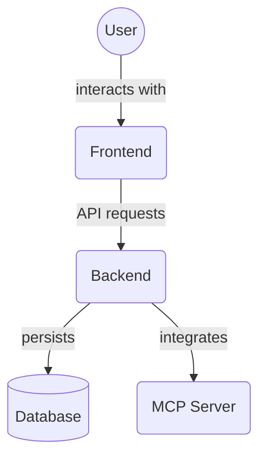

# Frontend Test Mocks (`frontend/src/__tests__/mocks/`)

This directory contains mock implementations and handlers used for testing purposes, particularly for simulating API responses. This allows tests to run without relying on a live backend.

Key files:

*   `handlers.ts`: Defines request handlers for mocked API endpoints.
*   `server.ts`: Sets up and configures the mock server (likely using libraries like MSW - Mock Service Worker).

## Architecture Diagram

<!-- File List Start -->
## File List

- `handlers.ts`
- `server.ts`

<!-- File List End -->

