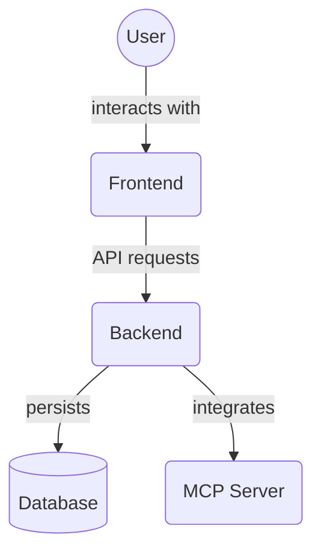

# Frontend Test Utilities (`frontend/src/__tests__/utils/`)

This directory contains utility functions and helpers specifically designed to support writing frontend tests. These utilities often provide custom render methods, setup functions, or other reusable logic to simplify test creation and maintenance.

Key files:

*   `test-utils.tsx`: Contains custom rendering utilities (likely re-exporting or extending `@testing-library/react` methods).

## Architecture Diagram

<!-- File List Start -->
## File List

- `test-utils.tsx`

<!-- File List End -->

