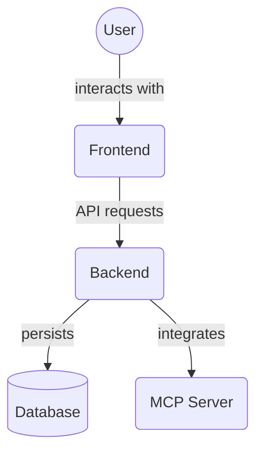

# Next.js Application Directory (`frontend/src/app/`)

This directory is the core of the Next.js application, utilizing the App Router. It contains the main page, root layout, global styles, and potentially other application-level configurations and route handlers.

## Key Files

### `layout.tsx`

- **Purpose**: Defines the root layout for the entire application.
- **Key Features**:
  - Sets up the basic HTML document structure (`<html>`, `<body>`).
  - Includes default metadata for the application (e.g., title, description) using Next.js `Metadata` type.
  - Wraps its `children` with the `ChakraProviderWrapper`. This is crucial as it provides the Chakra UI context, custom application theme (from `frontend/src/theme/index.ts`), and likely includes the `ModalProvider` for global modal management.
  - Ensures consistent styling and UI behavior across all pages.

### `page.tsx`

- **Purpose**: This client component (`'use client'`) serves as the primary user interface and entry point for the application, rendered at the root path (`/`).
- **Key Features**:
  - **Main Layout**: Implements a `Flex` layout consisting of a collapsible sidebar (`SidebarContent`) and a main content display area.
  - **Sidebar (`SidebarContent`)**:
    - Provides primary navigation links (e.g., "Dashboard", "Workboard", "Portfolio", "Registry").
    - Includes action buttons like "Add New Task", "Add New Project", "Add New Agent", "Import Plan", and a toggle for `MCPDevTools`.
    - Contains the `ThemeToggleButton`.
    - The sidebar's appearance and available actions can change based on the `activeView` and its collapsed state.
  - **View Management**: Manages an `activeView` state which determines the content of the main area. It can display:
    - `Dashboard` component.
    - `TaskList` component (for the "Workboard" view), typically alongside `FilterSidebar`.
    - `ProjectList` component (for the "Portfolio" view), typically alongside `FilterSidebar`.
    - `AgentList` component (for the "Registry" view), typically alongside `FilterSidebar`.
  - **Modal Integration**: Uses Chakra UI's `useDisclosure` to manage modals for:
    - Adding tasks (`AddTaskForm`).
    - Adding projects (`AddProjectForm`).
    - Adding agents (`AddAgentForm`).
    - Importing project plans via JSON `Textarea`.
    - Displaying an AI prompt generation modal.
  - **Functionality**:
    - Handles form submissions for creating new entities by calling API services.
    - Parses imported JSON plans to create projects and tasks.
    - Manages UI state (active view, modal states, sidebar collapse).
  - **State & UI**: Heavily relies on Zustand for state management (`useTaskStore`, `useProjectStore`, `useAgentStore`) and Chakra UI for all visual elements and interactions.

### `globals.css`

- **Purpose**: Contains global CSS styles that apply to the entire application. This can include base styles, resets, or utility classes. (Contents not read)

### `favicon.ico`

- **Purpose**: The icon file used by browsers for bookmarks, tabs, etc. This is the standard ICO format.

### `not-found.tsx`

- **Purpose**: Handles 404 errors by showing a friendly message and link back to the home page.

## 🎨 Theming Architecture & Best Practices

This application directory is built for a modern, themeable UI/UX experience using **Chakra UI** and **Tailwind CSS** with a dual-layered design token system.

### 🏗️ Theming Structure

- **ChakraProviderWrapper** (in `layout.tsx`):
  - Wraps the entire app, providing Chakra UI context and the custom theme (see `frontend/src/theme/chakra-theme.ts`).
  - Ensures all components have access to theme tokens and color mode switching.
- **ThemeProvider** (see `frontend/src/contexts/ThemeContext.tsx`):
  - Manages light/dark mode switching.
  - Applies the correct theme class and `data-theme` attribute to the HTML root.
- **Tailwind CSS**:
  - Utility classes are available for layout and rapid prototyping.
  - Custom properties (tokens) are referenced in global styles and can be used in custom CSS modules.
- **Global Styles (`globals.css`)**:
  - Imports Tailwind and sets up base font families and background/text colors using tokens.
  - Applies theme-aware styles to Chakra modals and other global elements.

### 🌗 Light/Dark Mode

- Theme switching is seamless and managed by the ThemeProvider.
- Chakra UI's color mode system and the TypeScript token system ensure all components adapt to the current theme.

### 🧩 Token Usage in App Directory

- **Always use tokens** for all design values (colors, spacing, typography, etc.).
- **Chakra UI props** (e.g., `bg`, `color`, `p`, `rounded`) should reference theme tokens.
- **No hardcoded values** or legacy CSS variables in new/updated code. Use only TypeScript tokens from `@tokens`.
- **Global styles** should reference tokens for backgrounds, text, and modal overlays.

### 🛠️ Best Practices

- Use Chakra UI for all component styling unless a layout/utility is not covered (then use Tailwind or CSS Modules).
- Reference the audit plan and `DESIGN_TOKENS.md` before making changes.
- Update documentation and add inline comments for any non-obvious theming logic.

---

For more details, see:

- `frontend/src/theme/chakra-theme.ts` (theme config)
- `frontend/src/contexts/ThemeContext.tsx` (theme switching logic)
- `frontend/src/app/globals.css` (global styles)
- `DESIGN_TOKENS.md` (token structure and usage)

## Subdirectories

The following subdirectory exists within `frontend/src/app/` and will be documented separately:

*   **`projects/[projectId]/`**: Contains the page component (`page.tsx`) for displaying details of a specific project.
    *   **`page.tsx`**: This page component (`'use client'`) is responsible for fetching and displaying a single project's details and its associated tasks. It serves as the primary view for managing tasks within the context of a project, including interactions related to task dependencies, file associations, and task archiving.

*   **`mcp-dev-tools/`**: Likely contains components or routes related to the "MCP Dev Tools" feature that is accessible from the main application page's sidebar. (Contents to be explored)

## Directory Contents Overview

This directory (`frontend/src/app/`) contains the core application pages and layout for the frontend, utilizing the Next.js App Router. Files within this directory define the structure and content of the main application views.

Key files and directories:

*   `layout.tsx`: Defines the root layout and providers for the application.
*   `page.tsx`: The main application page component at the root route (`/`).
*   `globals.css`: Global CSS styles.
*   `favicon.ico`: Application favicon.
*   `projects/[projectId]/`: Directory containing the page for individual project details.
*   `mcp-dev-tools/`: Directory likely related to developer tools/features.

## Architecture Diagram

<!-- File List Start -->
## File List

- `favicon.ico`
- `globals.css`
- `layout.tsx`
- `page.tsx`
- `not-found.tsx`

<!-- File List End -->
