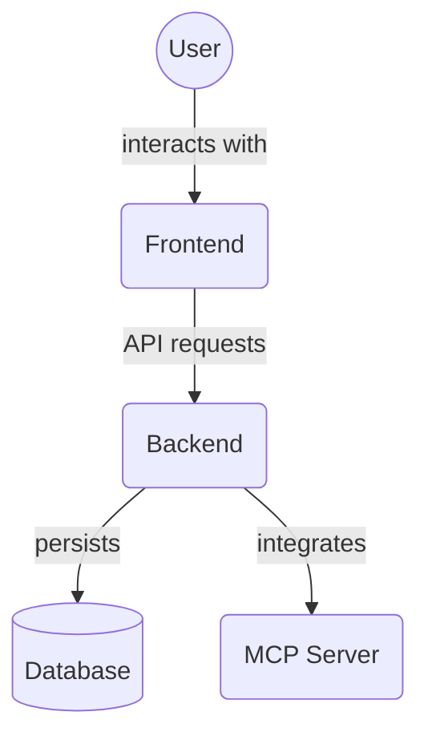

# MCP Dev Tools Page (`frontend/src/app/mcp-dev-tools/`)

This directory defines the Next.js route for the MCP Developer Tools page, accessible at `/mcp-dev-tools`.

## Files

### `page.tsx`

- **Purpose**: Serves as the entry point for the `/mcp-dev-tools` route.
- **Implementation**: This file directly imports and re-exports the `MCPDevTools` component from `frontend/src/components/MCPDevTools.tsx`.
- **Functionality**: As a result, navigating to `/mcp-dev-tools` in the browser will render the `MCPDevTools` component, which provides a dedicated interface for development and debugging related to MCP functionalities.

The `MCPDevTools` component itself (located in `frontend/src/components/`) is responsible for the actual UI and features of the developer tools panel.

## Architecture Diagram

<!-- File List Start -->
## File List

- `page.tsx`

<!-- File List End -->
