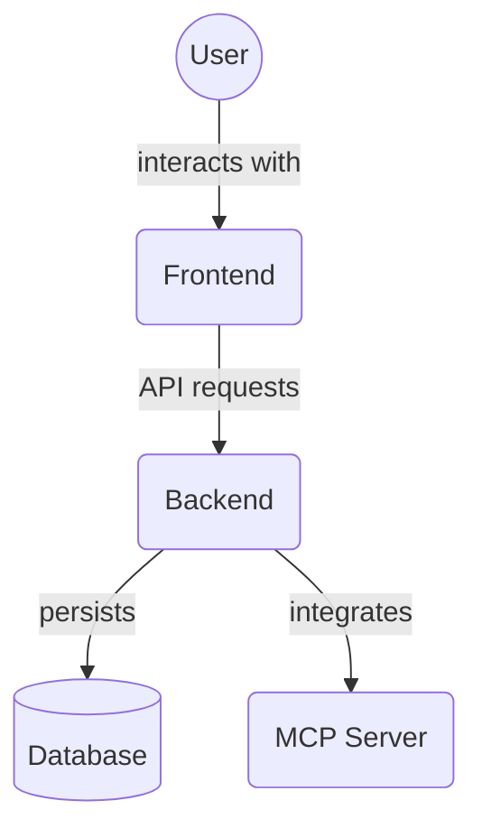

# Project Detail Page (`frontend/src/app/projects/[projectId]`)

This directory contains the page component for displaying the details of a specific project, identified by its `projectId` in the URL. This page serves as the main interface for viewing and managing tasks within that project.

Key file:

*   `page.tsx`: The page component responsible for fetching project and task data, displaying project information, and rendering the list of tasks for that project. It includes functionality for interacting with tasks (e.g., viewing details, marking complete, archiving, managing dependencies and file associations).

## Architecture Diagram

<!-- File List Start -->
## File List

- `page.tsx`

<!-- File List End -->

