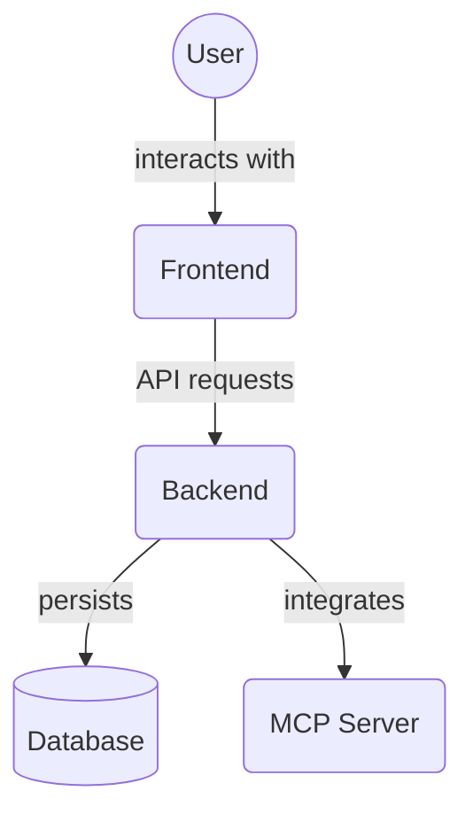

# Frontend UI Components (`frontend/src/components/`)

This directory houses all the React components that make up the user interface of the MCP Task Manager frontend.
Components are typically built using TypeScript (`.tsx`) and leverage the Chakra UI library for styling and UI elements, and Zustand for state management.

## Key Components

Below are summaries of some of the primary components in this directory. Most components interact with global stores (e.g., `useTaskStore`, `useProjectStore`, `useAgentStore`) to fetch and manipulate data, and use utility functions from `../lib/`.

### `Dashboard.tsx`

- **Purpose**: Acts as the main container and data processor for the dashboard page. It fetches and prepares data from various sources and then passes it to specialized modular components located in the `dashboard/` subdirectory for rendering.
- **Key Features**:
  - Uses `useTaskStore`, `useProjectStore`, `useAgentStore` (Zustand stores) to fetch and manage live application data (tasks, projects, agents, and their filters).
  - Additionally fetches all projects and tasks (including archived) via direct API calls (`api.getProjects`, `api.getTasks`) to calculate comprehensive statistics.
  - Performs extensive data processing and memoization using `useMemo` to calculate various metrics and data structures required by the dashboard modules. Examples include:
    - `filteredTasksForDashboard`, `filteredProjectsForDashboard`: Apply active filters.
    - `taskStats`: Counts of tasks by status category (completed, failed, in-progress, blocked, to-do).
    - `tasksOverTime`: Data for charting task creation and completion over the last 14 days.
    - `tasksPerProject`, `tasksPerAgent`: Aggregated task counts for projects and agents.
    - `statusCounts`: Task counts grouped by displayable status names for charts.
    - `unassignedTasks`, `topAgents`, `topProjects`, `recentActivity`.
  - Provides functions to generate pre-formatted text prompts for different categories of tasks (e.g., `getCompletedTaskPrompt`, `getPendingTaskPrompt`), which can be copied for agent interaction.
  - Renders a layout (likely a `VStack`) that includes various imported components from the `frontend/src/components/dashboard/` subdirectory, passing the processed data to them as props.
- **Key Imports**: Imports modular components like `DashboardStatsGrid`, `TaskStatusChart`, `TasksOverTimeChart`, etc., from `./dashboard/`.

### `TaskList.tsx`

- **Purpose**: Manages the display and interaction for the list of tasks. Supports different views (list, Kanban) and functionalities like filtering, sorting, and adding/editing tasks.
- **Key Features**:
  - Fetches tasks, projects, and agents using their respective Zustand stores.
  - Manages view modes (`list`, `kanban`) and potentially grouping (`status`, `project`, `agent`).
  - Implements filtering based on search terms, status, project, agent, and archive status, using `applyAllFilters` and `filters` from `useTaskStore`.
  - Handles sorting of tasks based on `sortOptions` from `useTaskStore`.
  - Integrates `AddTaskForm` for creating and editing tasks (via a modal).
  - Uses child components like `ListView`, `KanbanView`, `TaskControls`, `NoTasks`, `TaskLoading`, and `TaskError` to render the UI based on the current state and view mode.
  - Provides callbacks for opening modals to add/edit tasks.
  - Displays toast notifications for polling errors and mutation errors from the task store.

### Task Rendering and Management (`./task/`)

- **Overview**: Components responsible for displaying and interacting with individual tasks are grouped within the `frontend/src/components/task/` directory. This includes `TaskItem.tsx` itself, along with helper components for different parts of the task UI (e.g., main section, details section) and related modals like `EditTaskModal.tsx`.
- **Detailed Documentation**: For an in-depth explanation of the `TaskItem` architecture, its sub-components, data flow, and JSDoc references, see the dedicated **[Task Component Documentation](./task/README.md)**.

### `ProjectList.tsx`

- **Purpose**: Displays a list of projects, allowing users to view their status, manage them, and generate CLI prompts.
- **Key Features**:
  - Fetches projects using `useProjectStore` and tasks using `useTaskStore` (to calculate project progress).
  - Displays each project with its name, description, task count, completion progress, and status.
  - Provides actions per project: delete, archive/unarchive, and generate a detailed CLI prompt for project review and management.
  - Filtering capabilities based on search term, agent involvement, and project status (active, completed) via `projectFilters` from `useProjectStore`.
  - Uses Chakra UI components like `Menu`, `Modal` (for CLI prompt), and `AlertDialog` (for delete confirmation).

### `AgentList.tsx`

- **Purpose**: Displays a list of registered agents, their status, and allows for management actions.
- **Key Features**:
  - Fetches agents using `useAgentStore`, and tasks/projects to determine agent activity.
  - Displays each agent with their name, statistics (task count, project count), and current status (Active/Idle).
  - Provides actions per agent: edit name, delete, copy agent ID, and generate a CLI prompt with assigned tasks.
  - Supports adding new agents and editing existing ones via `AddAgentForm` and `EditAgentForm` (likely within modals).
  - Filtering capabilities based on search term and agent status (available, busy, offline) via `agentFilters` from `useAgentStore`.
  - Uses Chakra UI components for layout, modals, and menus.

## 🎨 Theming & Token Usage Best Practices

All UI components must follow the project's modern theming and design token system, powered by **Chakra UI** and **Tailwind CSS**.

### 🧩 Key Guidelines

- **Always use tokens** for all design values (colors, spacing, typography, etc.).
- **Prefer Chakra UI props** (e.g., `bg`, `color`, `p`, `rounded`) for styling components.
- Use **CSS Modules** only for structural/layout styles not covered by Chakra UI.
- **No hardcoded values** or legacy CSS variables in new/updated code. Use only TypeScript tokens from `@tokens`.
- **Support light/dark mode** by consuming semantic tokens and Chakra's color mode system.

### 🚀 Migration from Legacy CSS Variables

- **Old pattern:** Direct use of legacy CSS variables (e.g., `var(--core-colors-blue-500)`) or hardcoded values.
- **New pattern:** Import from `@tokens` (TypeScript) and use the exported constants in your components and theme files. Do not use CSS variables or tokens.css. All tokens are now managed in TypeScript.

### 🛠️ How to Contribute to Theming/UX

- Review `DESIGN_TOKENS.md` and `COMPONENT_AUDIT_AND_REFACTOR_PLAN.md` before making changes.
- Add or update tokens in `frontend/src/tokens/` and ensure they are mapped in `chakra-theme.ts`.
- Refactor components to use tokens and Chakra UI props.
- Update documentation and add inline comments for any non-obvious theming logic.
- If you find undocumented or inconsistent patterns, log them in the audit plan and propose improvements.

### ⚠️ Known Gaps & Ongoing Refactor

- Some components may still use legacy tokens or hardcoded values.
- See the audit plan for current priorities and progress.
- If you encounter legacy patterns, refactor to the new system and document your changes.

---

For more details, see:

- `DESIGN_TOKENS.md` (token philosophy, structure, usage)
- `COMPONENT_AUDIT_AND_REFACTOR_PLAN.md` (migration log)
- `frontend/src/theme/chakra-theme.ts` (theme config)

## Other Component Files

- `AddTaskForm.tsx`: Form for creating new tasks or editing existing ones.
- `TaskControls.tsx`: UI controls for task list (e.g., filtering, sorting, view switching).
- `TaskLoading.tsx`: Loading indicator for when tasks are being fetched.
- `NoTasks.tsx`: Component displayed when there are no tasks matching current filters.
- `TaskError.tsx`: Component displayed when there is an error loading tasks.
- `KanbanView.tsx`: Renders tasks in a Kanban board layout (columns by status).
- `ListView.tsx`: Renders tasks in a list layout, potentially hierarchical.
- `ThemeToggleButton.tsx`: A button to toggle between light and dark themes.
- `MCPDevTools.tsx`: A development tool panel for interacting with MCP functionalities.
- `LoadingSkeleton.tsx`: Generic skeleton loader for various content types.
- `AddProjectForm.tsx`: Form for creating new projects.
- `EditAgentForm.tsx`: Form for editing agent details.
- `AddAgentForm.tsx`: Form for registering new agents.
- `EditAgentModal.tsx`: Modal for editing agent details.
- `EditProjectModal.tsx`: Modal for editing project details.
- `ClientOnly.tsx`: Wrapper to ensure a component only renders on the client-side.
- `VirtualizedList.tsx`: Likely a component for rendering long lists efficiently.

## Subdirectories

- `common/`: Likely contains general-purpose, reusable components that are not specific to a single feature area (e.g., custom buttons, layout elements, form inputs).
- `dashboard/`: Contains modular components specifically designed for rendering different sections and visualizations within the main `Dashboard.tsx` view. These components receive processed data from `Dashboard.tsx` and are responsible for their specific presentation (e.g., statistical grids, charts, lists).
- `forms/`: Likely contains reusable form components or specific forms used for creating or editing data entities (e.g., `AddProjectForm`, `EditTaskForm` might be moved or created here).
- `modals/`: Contains various modal dialog components used throughout the application (e.g., confirmation modals, detail view modals like `TaskDetailsModal.tsx`).
- `subtasks/`: Contains components related to the display and management of subtasks within a parent task.
- `views/`: This new directory likely contains components that define larger view structures or layouts, possibly for different ways of displaying lists or collections of data (e.g., `ListView`, `KanbanView` might be moved or new view components defined here).

## Directory Contents Overview

This directory (`frontend/src/components/`) contains the reusable React components that build the user interface for the frontend application. Components are organized into subdirectories based on their function or the feature area they belong to.

Key files and directories:

*   `common/`: General-purpose reusable components.
*   `dashboard/`: Components specific to the dashboard view.
*   `forms/`: Reusable form components or specific forms.
*   `modals/`: Modal dialog components.
*   `subtasks/`: Components related to subtask management.
*   `task/`: Components for displaying and interacting with individual tasks.
*   `views/`: Components defining larger view structures or layouts.
*   Individual component files like `TaskList.tsx`, `ProjectList.tsx`, `AgentList.tsx`, `AddTaskForm.tsx`, etc.

## Architecture Diagram

<!-- File List Start -->
## File List

- `AgentList.tsx`
- `BulkActionsBar.tsx`
- `ClientOnly.tsx`
- `Dashboard.tsx`
- `LoadingSkeleton.tsx`
- `MCPDevTools.tsx`
- `NoTasks.tsx`
- `ProjectList.tsx`
- `SettingsContent.tsx`
- `TaskAgentTag.tsx`
- `TaskControls.tsx`
- `TaskError.tsx`
- `TaskItemModals.tsx`
- `TaskList.tsx`
- `TaskList.utils.ts`
- `TaskLoading.tsx`
- `TaskProjectTag.tsx`
- `TaskStatusTag.tsx`
- `TaskViewControls.tsx`
- `ThemeToggleButton.tsx`
- `VirtualizedList.tsx`
- `useTaskItemStyles.ts`
- `useTaskListState.ts`

<!-- File List End -->

