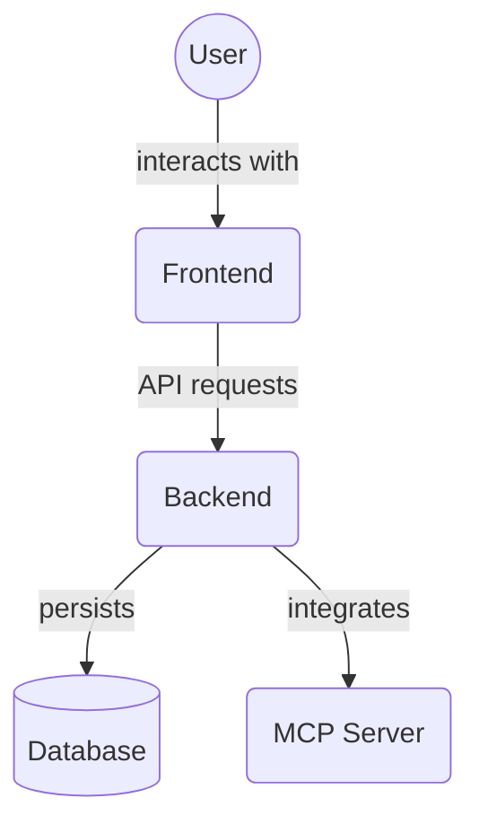

# Theme Toggle Button Component (`frontend/src/components/ThemeToggleButton/`)

This directory contains the reusable component for toggling between light and dark themes in the frontend application.

Key file:

*   `ThemeToggleButton.tsx`: A button component that uses the application's theme context to switch between defined color modes.

## Architecture Diagram

<!-- File List Start -->
## File List

- `ThemeToggleButton.tsx`

<!-- File List End -->
