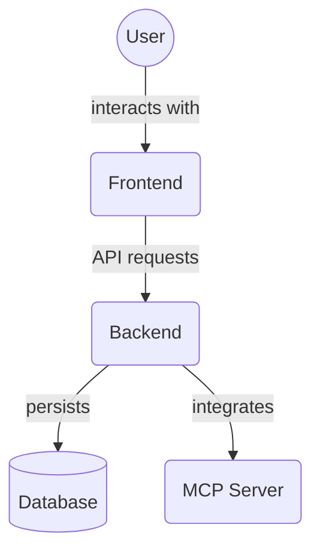

# Agent Components (`frontend/src/components/agent/`)

This directory contains React components related to displaying and managing AI agents within the frontend application.

Key files:

*   `AgentList.tsx`: Component for displaying a list of agents.
*   `AgentCard.tsx`: Component for displaying a single agent's information (likely used within `AgentList`).
*   `AgentListHeader.tsx`: Component for the header section of the agent list, potentially including search/filter or add agent buttons.
*   `AddAgentModal.tsx`: Modal for adding a new agent.
*   `EditAgentModal.tsx`: Modal for editing an existing agent.
*   `CliPromptModal.tsx`: Modal related to command-line interface prompts, potentially used in agent interactions.

## Architecture Diagram

<!-- File List Start -->
## File List

- `AddAgentModal.tsx`
- `AgentCard.tsx`
- `AgentList.tsx`
- `AgentListHeader.tsx`
- `CliPromptModal.tsx`
- `EditAgentModal.tsx`
- `AgentDetail.tsx`

<!-- File List End -->

