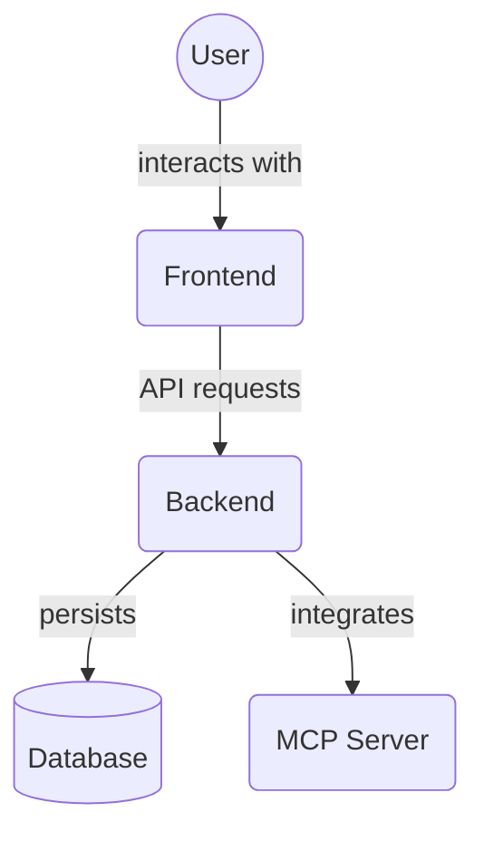

# Audit Logs Components (`frontend/src/components/audit_logs/`)

This directory contains React components for displaying audit logs related to specific entities within the application (e.g., tasks, projects, agents).

Key files:

*   `AuditLogListForEntity.tsx`: Component that displays a list of audit log entries filtered by a specific entity (e.g., task ID, project ID).

## Architecture Diagram

<!-- File List Start -->
## File List

- `AuditLogListForEntity.tsx`

<!-- File List End -->
