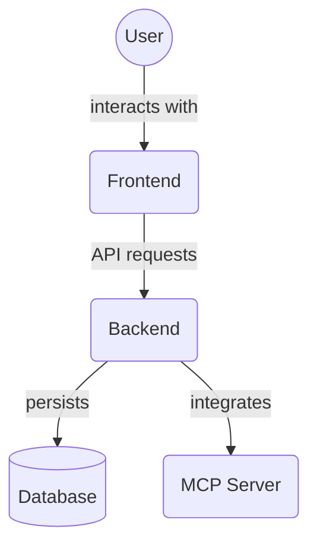

# Dev Tools Components (`frontend/src/components/devtools/`)

This directory houses the individual components that power the MCP developer tools panel. They are loaded by `MCPDevTools.tsx` and can also be used independently for testing.

## Key Components

- `APITester.tsx`: UI for invoking backend MCP API tools directly and viewing responses.
- `MemoryViewer.tsx`: Displays stored memory entities and allows searching by tag.
- `TaskRunner.tsx`: Simple interface for executing tasks through the MCP system.

## Architecture Diagram

<!-- File List Start -->

## File List

- `APITester.tsx`
- `MemoryViewer.tsx`
- `TaskRunner.tsx`
- `index.ts`

<!-- File List End -->
