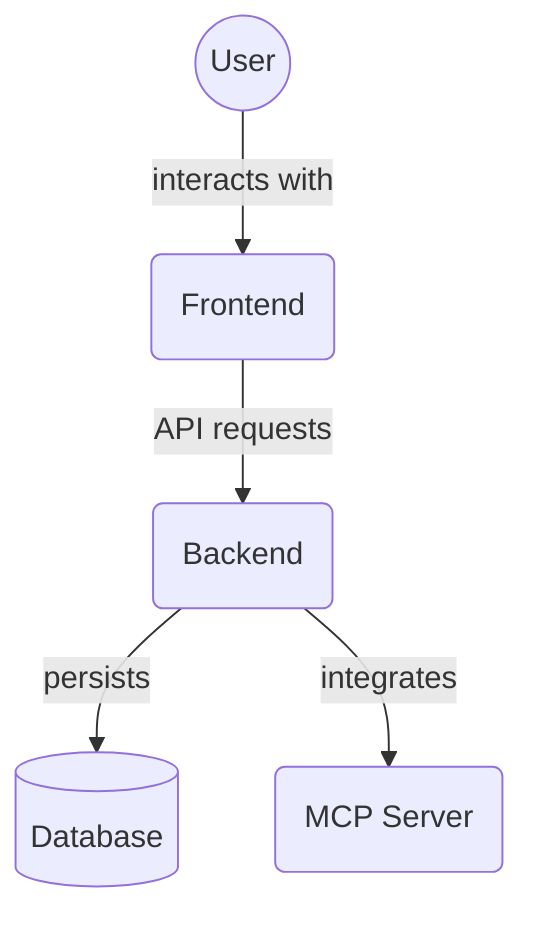

# Frontend Layout Components (`frontend/src/components/layout`)

This directory contains components responsible for the overall page layout and structure of the frontend application. These components define the main visual areas of the application, such as sidebars and content areas.

Key files:

*   `Sidebar.tsx`: Implements the main application sidebar, containing navigation links, action buttons, and other global controls.
*   `MainContent.tsx`: Defines the main content area where different views (dashboard, task list, project list, etc.) are rendered.

## Architecture Diagram

<!-- File List Start -->
## File List

- `MainContent.tsx`
- `Sidebar.tsx`

<!-- File List End -->

