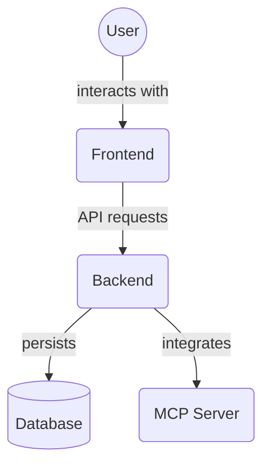

# Modal Components (`frontend/src/components/modals/`)

This directory contains modal dialog components used for displaying detailed information or requiring specific user interactions.

## Files

### `TaskDetailsModal.tsx`

- **Purpose**: Displays a modal dialog with comprehensive details about a specific task. It allows users to view and manage **task dependencies**, view and add **associated files (Memory entities)**, and provides actions related to the task, such as archiving, unarchiving, and deleting.
- **Props**:
  - `isOpen: boolean`: Controls the visibility of the modal.
  - `onClose: () => void`: Callback function executed when the modal is closed.
  - `taskId: string | null`: The unique identifier of the task whose details are to be displayed. If `null`, the modal will typically show a default or empty state.
- **Key Features**:
  - **Data Fetching**: When opened with a `taskId`, it attempts to find the task in the global Zustand store (`useTaskStore`). If not found, it fetches task details from the API using `getTaskById`.
  - **Information Display**: Shows various task attributes, including:
    - Title (in the modal header, with a loading spinner during fetch).
    - Archived status (displayed as a badge).
    - Description.
    - **Task Dependencies Management**: Displays existing dependencies and allows users to add or remove dependencies.
    - **Associated Files Management**: Displays linked files (Memory entities) and provides an interface to add new file associations.
    - Current Status (rendered with appropriate styling, color, and icon using `getDisplayableStatus` from `../../lib/statusUtils`).
    - Associated Project Name (retrieved by looking up `task.project_id` in the projects list from `useTaskStore`).
    - Assigned Agent Name (retrieved from `task.agent_name` or by looking up `task.agent_id` in the agents list from `useTaskStore`).
  - **Actions**:
    - If the task is **not archived**: Provides "Archive Task" and "Delete Task" buttons.
    - If the task is **archived**: Provides "Unarchive Task" and "Delete Permanently" buttons.
    - Deletion actions trigger a confirmation dialog (`AlertDialog`) before proceeding.
  - **State Management**: Interacts with `useTaskStore` for performing `archiveTask`, `unarchiveTask`, and `deleteTask` operations.
  - **UI Feedback**: Shows loading spinners during data fetching and uses Chakra UI `toast` notifications for the results of actions (success/error).
- **Dependencies**: Relies on Chakra UI for modal components and styling, Zustand (`useTaskStore`) for state, and utility functions for status display.
- **Styling**: Primarily uses Chakra UI components. All styling is now handled via Chakra UI props and global CSS using the design token system. No CSS Modules are used.
- **Exports**: `TaskDetailsModal` (React Functional Component).

## Directory Contents Overview

This directory (`frontend/src/components/modals/`) contains reusable modal dialog components used throughout the frontend application for displaying information or capturing user input.

Key files:

*   `TaskDetailsModal.tsx`: Modal for viewing and managing detailed task information, dependencies, and file associations.
*   `EditTaskModal.tsx`: Modal containing the form for editing a task.
*   `AddTaskModal.tsx`: Modal containing the form for adding a new task.
*   `EditProjectModal.tsx`: Modal containing the form for editing a project.
*   `CreateProjectModal.tsx`: Modal containing the form for creating a new project.
*   `EditAgentModal.tsx`: Modal containing the form for editing agent details.
*   `AddAgentModal.tsx`: Modal containing the form for adding a new agent.
*   `AgentAssignmentModal.tsx`: Modal likely for assigning agents to tasks or projects.
*   `ImportPlanModal.tsx`: Modal for importing project plans from a file or text.
*   `DevToolsDrawer.tsx`: Likely a modal or drawer component for developer tools.
*   `README.md`: This file.

## Architecture Diagram

<!-- File List Start -->
## File List

- `AddAgentModal.tsx`
- `AddProjectModal.tsx`
- `AddTaskModal.tsx`
- `AgentAssignmentModal.tsx`
- `CreateProjectModal.tsx`
- `DevToolsDrawer.tsx`
- `EditAgentModal.tsx`
- `EditProjectModal.tsx`
- `EditTaskModal.tsx`
- `ImportPlanModal.tsx`
- `TaskDetailsModal.tsx`

<!-- File List End -->
