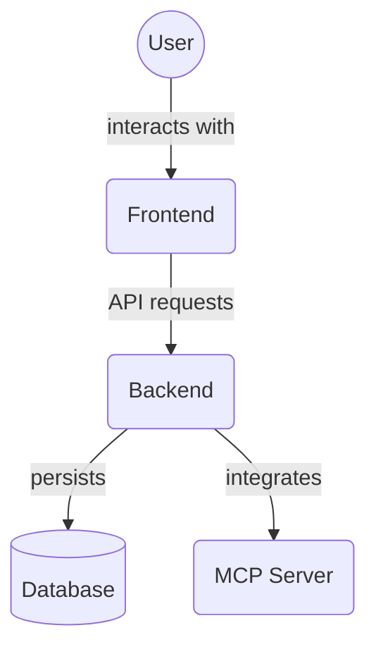

# Project Components (`frontend/src/components/project/`)

This directory contains React components for displaying and managing project-related information within the frontend application.

Key files:

<<<<<<< HEAD
- `ProjectList.tsx`: Component for displaying a list of projects.
- `ProjectDetail.tsx`: Component for displaying the detailed information of a single project.
- `ProjectFiles.tsx`: Component for displaying and managing files associated with a project.
- `ProjectMembers.tsx`: Component for displaying and managing members associated with a project.
=======
*   `ProjectList.tsx`: Container for project data and list layout.
*   `ProjectCard.tsx`: Displays a single project's summary information.
*   `ProjectCardMenu.tsx`: Menu with edit/archive/delete actions for a project.
*   `CliPromptModal.tsx`: Modal for copying a CLI command to fetch a project.
*   `DeleteProjectDialog.tsx`: Confirmation dialog for deleting a project.
*   `ProjectDetail.tsx`: Detailed view of a single project.
*   `ProjectFiles.tsx`: Displays and manages project file attachments.
*   `ProjectMembers.tsx`: Shows and manages project members.
>>>>>>> origin/5wywo3-codex/finish-splitting-components-and-add-tests

## Architecture Diagram

<!-- File List Start -->
## File List

<<<<<<< HEAD
- `CliPromptModal.tsx`
- `DeleteProjectDialog.tsx`
- `ProjectCard.tsx`
- `ProjectCardMenu.tsx`
=======
- `ProjectCard.tsx`
- `ProjectCardMenu.tsx`
- `CliPromptModal.tsx`
- `DeleteProjectDialog.tsx`
>>>>>>> origin/5wywo3-codex/finish-splitting-components-and-add-tests
- `ProjectDetail.tsx`
- `ProjectFiles.tsx`
- `ProjectList.tsx`
- `ProjectMembers.tsx`
- `ProjectMenu.tsx`

<!-- File List End -->

