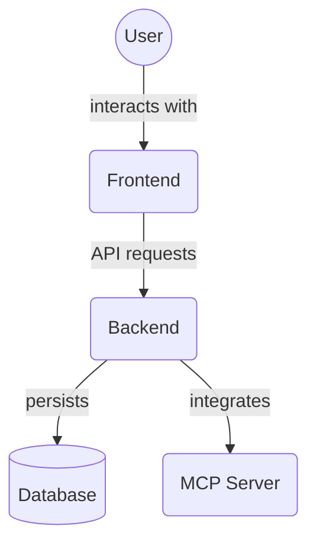

# Project Components (`frontend/src/components/project/`)

This directory contains React components for displaying and managing project-related information within the frontend application.

Key files:

- `ProjectList.tsx`: Component for displaying a list of projects.
- `ProjectDetail.tsx`: Component for displaying the detailed information of a single project.
- `ProjectFiles.tsx`: Component for displaying and managing files associated with a project.
- `ProjectMembers.tsx`: Component for displaying and managing members associated with a project.

## Architecture Diagram

<!-- File List Start -->

## File List

- `CliPromptModal.tsx`
- `DeleteProjectDialog.tsx`
- `ProjectCard.tsx`
- `ProjectCardMenu.tsx`
- `ProjectMenu.tsx`
- `ProjectDetail.tsx`
- `ProjectFiles.tsx`
- `ProjectList.tsx`
- `ProjectMembers.tsx`

<!-- File List End -->
