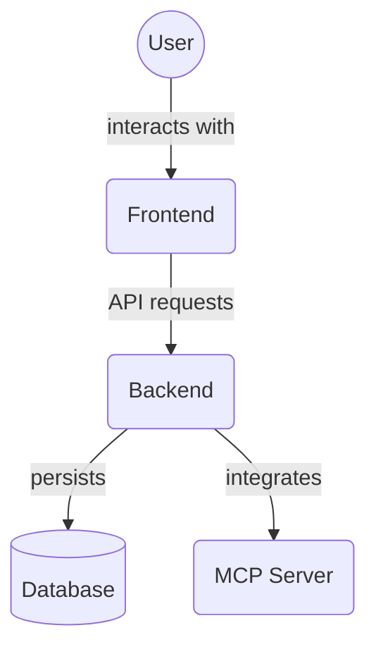

# Frontend Contexts (`frontend/src/contexts/`)

This directory contains React Context providers and hooks for managing global or widely shared state across the frontend application.

## Directory Contents Overview

This directory (`frontend/src/contexts/`) contains React Context providers and hooks for managing global or widely shared state across the frontend application. These are typically used at a high level in the application tree.

Key files:

*   `ThemeContext.tsx`: Provides context for managing the application's theme (light/dark mode).
*   `ProjectContext.tsx`: A placeholder context likely intended for project-related data.
*   `README.md`: This file.

## Files

### `ProjectContext.tsx`

## Architecture Diagram

<!-- File List Start -->
## File List

- `ProjectContext.tsx`
- `ThemeContext.tsx`

<!-- File List End -->
