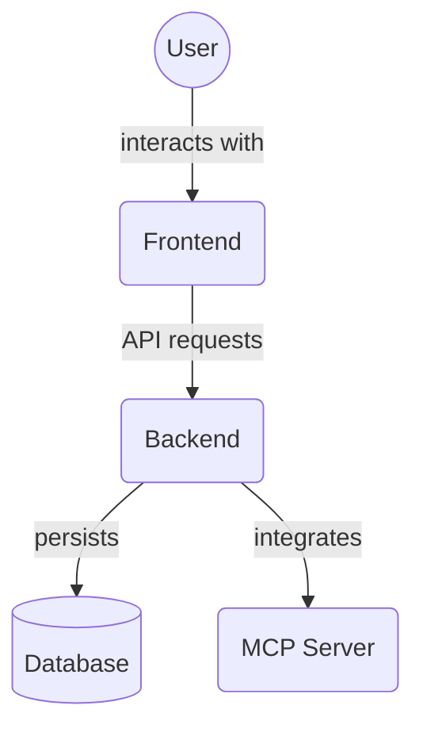

# Frontend Library (`frontend/src/lib/`)

This directory contains utility functions, type definitions, and configurations that are shared across the frontend application.

## Files

### `utils.ts`

Provides general utility functions.

- **`formatDisplayName(name?: string | null): string`**

  - Formats a given string (e.g., a project or agent name) into a more readable display format.
  - Replaces underscores (`_`) and hyphens (`-`) with spaces.
  - Capitalizes the first letter of each word.
  - Returns `'Unnamed'` if the input is `null`, empty, or contains only whitespace.
  - Syntax: `export const formatDisplayName = (name?: string | null): string => { ... };`

- **`mapStatusToStatusID(status: Status | string | null | undefined): CanonicalStatusID`**
  - Maps various status string inputs to a canonical `StatusID` (defined in `statusUtils.ts`).
  - Handles common display names (e.g., "to do", "in progress") in a case-insensitive manner.
  - Attempts to match uppercased and underscored versions of status strings if they correspond to a known `CanonicalStatusID`.
  - Defaults to `'TO_DO'` for null, undefined, empty, or unrecognized status values, and logs a console warning for unknown statuses.
  - Dependencies: Imports `Status` from `@/types` and `getStatusAttributes`, `StatusID as CanonicalStatusID` from `@/lib/statusUtils`.
  - Syntax: `export const mapStatusToStatusID = (status: Status | string | null | undefined): CanonicalStatusID => { ... };`

### `statusUtils.ts`

This is a comprehensive module for defining, managing, and retrieving display properties for task statuses, ensuring consistency across the UI.

- **Type Definitions**:

  - `StatusID`: A union type defining canonical string identifiers for task statuses (e.g., `'TO_DO'`, `'IN_PROGRESS'`, `'COMPLETED_HANDOFF_TO_...'`).
  - `StatusAttributeObject`: An interface that defines the structure for status attributes, including:
    - `id: StatusID`: The canonical status identifier.
    - `displayName: string`: User-friendly name for UI display.
    - `category: 'todo' | 'inProgress' | 'pendingInput' | 'completed' | 'failed' | 'blocked'`: Broad category for filtering/grouping.
    - `description: string`: Detailed explanation of the status.
    - `colorScheme: string`: Suggested Chakra UI color scheme.
    - `icon?: As | string`: Placeholder or actual icon representation.
    - `isTerminal: boolean`: Indicates if the status is a final state.
    - `isDynamic: boolean`: Indicates if the status string can contain dynamic parts.
    - `dynamicPartsExtractor?: string | RegExp`: RegExp to extract dynamic parts.
    - `dynamicDisplayNamePattern?: string`: Template for dynamic display names.

- **Constants**:

  - `STATUS_MAP: Readonly<Record<StatusID, StatusAttributeObject>>`: The core mapping where each `StatusID` is associated with its `StatusAttributeObject`. This serves as the single source of truth for all status definitions. It includes predefined statuses like `'TO_DO'`, `'IN_PROGRESS'`, `'BLOCKED'`, `'COMPLETED'`, `'CONTEXT_ACQUIRED'`, `'PLANNING_COMPLETE'`, `'EXECUTION_IN_PROGRESS'`, `'PENDING_VERIFICATION'`, `'VERIFICATION_COMPLETE'`, `'VERIFICATION_FAILED'`, `'COMPLETED_AWAITING_PROJECT_MANAGER'`, `'COMPLETED_HANDOFF_TO_...'`, `'FAILED'`, `'IN_PROGRESS_AWAITING_SUBTASK'`, and `'PENDING_RECOVERY_ATTEMPT'`.

- **Exported Functions**:
  - `getStatusAttributes(statusId: StatusID): StatusAttributeObject | undefined`
    - Retrieves the complete `StatusAttributeObject` for a given canonical `StatusID`.
    - Syntax: `export function getStatusAttributes(statusId: StatusID): StatusAttributeObject | undefined { ... }`
  - `getDisplayableStatus(statusId: string, fallbackTitleOrDynamicValue?: string): { displayName: string; colorScheme: string; icon?: As | string; dynamicValue?: string } | undefined`
    - Takes a status string (which can be a full dynamic ID) and an optional fallback or dynamic value.
    - Returns an object with `displayName`, `colorScheme`, `icon`, and potentially `dynamicValue` for UI rendering.
    - Handles dynamic statuses by attempting to match a base `StatusID`, extracting dynamic parts using `dynamicPartsExtractor`, and formatting the `displayName` using `dynamicDisplayNamePattern`.
    - Syntax: `export function getDisplayableStatus(...) { ... }`
  - `getFallbackDisplayableStatus(originalStatusId: string, fallbackTitle?: string): { ... }`
    - Provides a default displayable status object if the original status ID cannot be resolved, using a generic "Unknown Status" display name or a provided `fallbackTitle`.
    - Syntax: `export function getFallbackDisplayableStatus(...) { ... }`
  - `getAllStatusIds(): StatusID[]`
    - Returns an array of all defined canonical `StatusID` string values.
    - Syntax: `export function getAllStatusIds(): StatusID[] { ... }`

### `mcpTools.ts`

Defines the structure and provides a list of available MCP (Multi-Context Persona) API tools/endpoints for frontend interaction.

- **Interfaces**:

  - `ApiToolParameter`: Defines the structure for a parameter of an API tool.
    - Properties: `name: string`, `type: 'string' | 'number' | 'boolean' | 'json_object_string'`, `required: boolean`, `description?: string`, `isPathParameter?: boolean`, `isQueryParameter?: boolean`, `isBodyParameter?: boolean`.
  - `ApiToolDefinition`: Defines the structure for an API tool.
    - Properties: `id: string` (unique identifier), `label: string` (user-friendly name), `method: 'GET' | 'POST' | 'PUT' | 'DELETE'`, `path: string` (API endpoint path), `parameters: ApiToolParameter[]`, `description?: string`.

- **Constants**:
  - `mcpTools: ApiToolDefinition[]`: An exported array containing the definitions for all available MCP tools. Each object in the array adheres to the `ApiToolDefinition` interface.
    - Examples of defined tools include:
      - Root: `get_root_message`
      - Projects: `create_project`, `get_project_list`, `get_project_by_id`, `update_project`, `delete_project`
      - Agents: `create_agent`, `get_agent_list`, `get_agent_by_name`, `get_agent_by_id`, `update_agent`, `delete_agent`
      - Tasks: `create_task`, `get_task_list`, `get_task_by_id`, `update_task`, `delete_task`
      - Planning: `generate_planning_prompt`
    - Each tool definition specifies its HTTP method, path, parameters (including their type, whether they are required, and if they are path, query, or body parameters), and a brief description.

## Architecture Diagram

<!-- File List Start -->
## File List

- `mcpTools.ts`
- `promptUtils.ts`
- `statusUtils.test.ts`
- `statusUtils.ts`
- `taskUtils.ts`
- `utils.ts`

<!-- File List End -->
