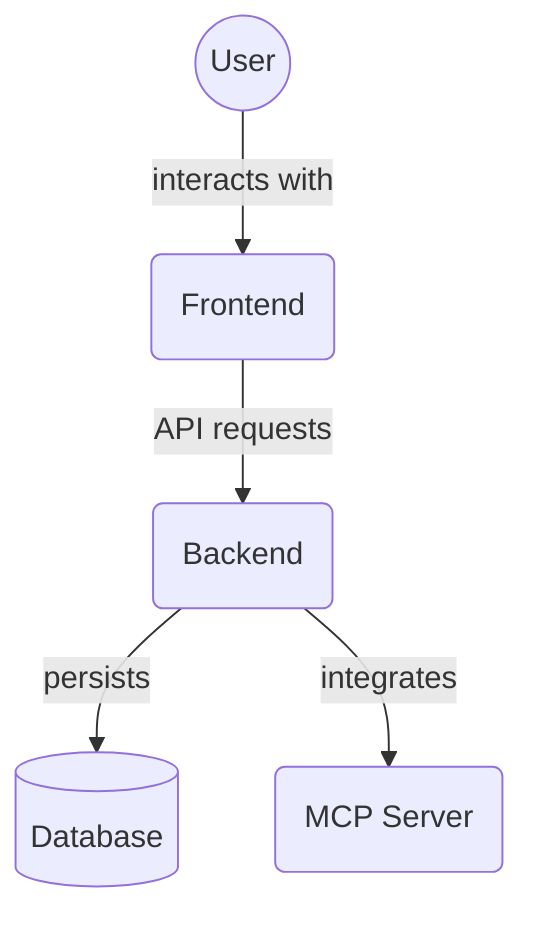

# Frontend Providers (`frontend/src/providers/`)

This directory contains React components that act as context providers, setting up library configurations or making global state/services available to their child components. These are typically used at a high level in the application tree.

## Files

### `ChakraProviderWrapper.tsx`

- **Purpose**: A client-side component (`'use client'`) that serves as the primary wrapper for providing the Chakra UI theme and context to the application. It also includes the `ModalProvider`.
- **Key Features**:
  - Wraps its `children` with the `ChakraProvider` from `@chakra-ui/react`.
  - Initializes `ChakraProvider` with the custom application theme imported from `'@/theme'` (which refers to the detailed theme defined in `frontend/src/theme/index.ts`). This makes all custom styles, semantic tokens, and component variants available throughout the app.
  - Includes the `ModalProvider` as a child of `ChakraProvider`, ensuring that `react-modal` setup (important for accessibility) is done within the Chakra context.
- **Props**: `children: React.ReactNode`.
- **Exports**: `ChakraProviderWrapper` (Default React Functional Component).
- **Usage**: This component should be used in the root layout of the Next.js application (e.g., `app/layout.tsx`) to ensure that all pages and components have access to the Chakra UI theme and `react-modal` is properly configured.

  ```tsx
  // Example in app/layout.tsx
  import ChakraProviderWrapper from "@/providers/ChakraProviderWrapper";

  export default function RootLayout({
    children,
  }: {
    children: React.ReactNode;
  }) {
    return (
      <html lang="en">
        <body>
          <ChakraProviderWrapper>{children}</ChakraProviderWrapper>
        </body>
      </html>
    );
  }
  ```

### `ModalProvider.tsx`

- **Purpose**: A client-side component (`'use client'`) designed to correctly initialize the `react-modal` library, which is often a dependency or used internally by UI libraries for modal dialogs.
- **Key Features**:
  - Uses a `useEffect` hook to call `Modal.setAppElement(document.body)` when the component mounts.
  - `Modal.setAppElement()` is crucial for accessibility in `react-modal`, as it helps hide other content from screen readers when a modal is open.
  - Setting `document.body` is a common practice in Next.js 13+ App Router applications.
- **Props**: `children: React.ReactNode`.
- **Exports**: `ModalProvider` (Default React Functional Component).
- **Usage**: This provider is intended to be used high up in the component tree. In this project, it is conveniently wrapped by `ChakraProviderWrapper`.

## Architecture Diagram


<!-- File List Start -->
## File List

- `ChakraProviderWrapper.tsx`
- `ModalProvider.tsx`

<!-- File List End -->

