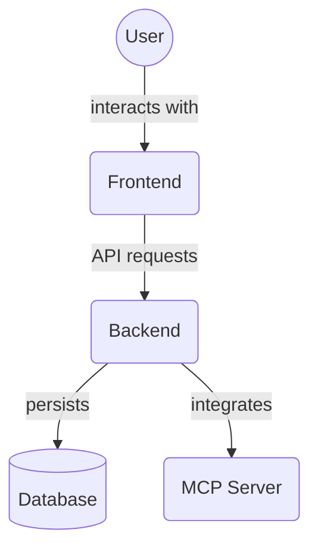

# Zustand State Management Stores (`frontend/src/store/`)

This directory contains all Zustand state management stores used in the frontend application. Zustand is a small, fast, and scalable state-management solution.

These stores centralize application state and logic for handling data related to tasks, projects, and agents, including their CRUD operations, filtering, sorting, and polling for updates.

## Key Files

### `baseStore.ts`

- **Purpose**: Provides a factory function (`createBaseStore`) and common utilities for creating Zustand stores with a consistent structure.
- **Key Features**:
  - Defines a `BaseState` interface including `loading` (boolean), `error` (string | null), and a `clearError` function.
  - The `createBaseStore` factory function initializes new stores with this base state, user-defined initial data, and an actions creator function.
  - Supports optional state persistence via `zustand/middleware/persist`, configured with a store name and version.
  - Includes an `extractErrorMessage` utility to standardize error message extraction.
  - Provides a `withLoading` higher-order function that wraps asynchronous operations (like API calls) to automatically manage the `loading` and `error` states within the store.

### `projectStore.ts`

- **Purpose**: Manages state related to projects.
- **State (`ProjectState`)**: Includes `projects` (array of `Project`), `loading`, `error`, `filters` (`ProjectFilters`), and polling-related state (`pollingIntervalId`, `isPolling`, `pollingError`).
- **Actions**:
  - `fetchProjects`: Fetches projects from the API (`getProjects`) based on filters. Uses an `upsertProjects` helper (with shallow equality checks) to efficiently update the `projects` array and preserve object references where possible.
  - CRUD operations: `addProject`, `editProject`, `removeProject` (which also triggers `removeTasksByProjectId` in `taskStore`).
  - `archiveProject` / `unarchiveProject`: Handles archiving/unarchiving projects and triggers corresponding actions in `taskStore`.
  - `setFilters`: Updates filters and re-fetches.
  - `startPolling` / `stopPolling`: Manages periodic re-fetching of projects, using `debounce`.
- **Note**: Does not use `createBaseStore` directly but implements similar patterns.

### `taskStore.ts`

- **Purpose**: Manages state related to tasks.
- **State (`TaskState`)**: Includes `tasks` (array of `Task`), `loading`, `isPolling`, `error`, `pollingError`, `mutationError` (with context), `editingTask`, `isEditModalOpen`, `sortOptions`, `filters` (`TaskFilters`), cached `projects` and `agents` lists, `pollingIntervalId`, and `selectedTaskIds` for bulk operations.
- **Actions**:
  - `fetchTasks`: Fetches tasks from the API (`getTasks`) based on filters. Also uses `upsertTasks` and `areTasksEqual` (with `zustand/shallow` for comparison) for efficiency. Sorts tasks locally using a `sortTasks` helper.
  - `fetchProjectsAndAgents`: Fetches related data for context/filters.
  - CRUD operations: `addTask`, `updateTask`, `deleteTask`.
  - `archiveTask` / `unarchiveTask`, `archiveTasksByProjectId` / `unarchiveTasksByProjectId`.
  - `setSortOptions`, `setFilters`.
  - `startPolling` / `stopPolling`: Manages polling for tasks and related project/agent data.
  - Bulk actions: `bulkDeleteTasks`, `bulkSetStatusTasks` using `selectedTaskIds`.
  - Task Dependencies Actions: `fetchTaskDependencies`, `addTaskDependency`, `removeTaskDependency`.
  - Task File Associations Actions: `fetchTaskFileAssociations`, `addTaskFileAssociation`, `removeTaskFileAssociation`.
  - `removeTasksByProjectId`: Removes tasks associated with a specific project.
- **Note**: Does not use `createBaseStore` directly but implements similar patterns.

### `agentStore.ts`

- **Purpose**: Manages state related to agents.
- **Store Creation**: Uses the `createBaseStore` factory from `baseStore.ts`, configured for persistence (`name: 'agent-store'`).
- **State (`AgentState`)**: Extends `BaseState` and includes `agents` (array of `Agent`), `editingAgent`, `isEditModalOpen`, `sortOptions`, and `filters`.
- **Actions**:
  - `fetchAgents`: Fetches agents from the API (`getAgents`). Uses `upsertAgents` and sorts locally with a `sortAgents` helper.
  - CRUD operations: `addAgent`, `editAgent` (wrapped with `withLoading`), `removeAgent`.
  - `openEditModal` / `closeEditModal`.
  - `setSortOptions`, `setFilters`.

### `index.ts`

- **Purpose**: Acts as a barrel file, re-exporting all public members from `taskStore.ts`, `projectStore.ts`, `agentStore.ts`, and `baseStore.ts`.
- **Usage**: Provides a single, convenient import point for accessing any of the store hooks or types (e.g., `import { useTaskStore, useProjectStore } from '@/store';`).

These stores are fundamental to the application's reactivity and data flow, providing a structured way to manage and interact with backend data on the client side.

## Architecture Diagram

<!-- File List Start -->

## File List

- `agentStore.ts`
- `authStore.ts`
- `baseStore.ts`
- `index.ts`
- `projectStore.ts`
- `taskStore.ts`
- `memoryStore.ts`

<!-- File List End -->
