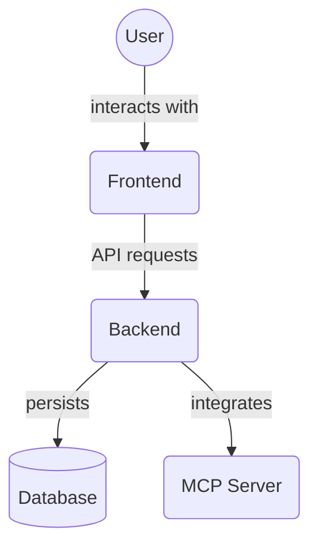

# Frontend Theme Configuration (`frontend/src/theme/`)

This directory contains the configuration for the application's visual theme, primarily using Chakra UI.

Key files:

*   `chakra-theme.ts`: Defines the custom theme object for Chakra UI, including color palettes, typography, component styles, and semantic tokens.
*   `__tests__/`: Contains unit tests for the theme configuration.

## Architecture Diagram

<!-- File List Start -->
## File List

- `chakra-theme.ts`

<!-- File List End -->

